# 中华人民共和国国家标准

GB 11551-2014

代替GB11551--2003

# 汽车正面碰撞的乘员保护

# The protection of the occupants in the event of a frontal collision for motor vehicle

2014-09-03 发布

2015-01-01实施

## 目 次

前言  
1范围  
2 规范性引用文件  
3 术语和定义  
4 要求 2  
5 试验方法… 5  
6 车辆型式的变更和扩展 9  
7标准实施的过渡期要求 9  
附录A（规范性附录）乘坐位置H点和实际靠背角的确定程序 10  
附录B（规范性附录）性能指标的确定… 17  
附录C（规范性附录）假人的布置和约束系统的调整 19  
附录D（规范性附录）测试技术：仪器 22  
附录E（规范性附录）滑车试验程序 27

## 前 言

本标准的全部技术内容为强制性的。

本标准按照GB/T1.1—2009 给出的规则起草。

本标准代替GB11551—2003《乘用车正面碰撞的乘员保护》。

本标准与GB11551—2003的主要差异有：

标准名称修改为《汽车正面碰撞的乘员保护》;

-修改了标准适用范围，由“M类车"扩展为"M类汽车和最大设计总质量不大于2500 kg的Ni类汽车，以及多用途货车”（见第1章）；

-增加了“多用途货车"的定义(见3.10)；

-增加了安全气囊的提示信息和在具有安全气囊保护的座位上使用后向儿童约束系统的警告信息（见4.1.4和4.1.5)；

-增加和修改了技术要求的部分内容(见4.2)；

-增加了车辆型式的变更和扩展(见第6章)；

-增加了滑车试验程序(见附录E)。

本标准由中华人民共和国工业和信息化部提出。

本标准由全国汽车标准化技术委员会(SAC/TC114)归口。

本标准负责起草单位：中国汽车技术研究中心、哈飞汽车股份有限公司、北汽福田汽车股份有限公司。

本标准参加起草单位：上汽通用五菱汽车股份有限公司、国家汽车质量监督检验中心（襄阳）、重庆长安汽车股份有限公司、浙江吉利汽车研究院有限公司、一汽大众汽车有限公司、清华大学汽车系、泛亚汽车技术中心有限公司、上海汽车集团股份有限公司、上海大众汽车有限公司、中国质量认证中心、上海机动车检测中心、神龙汽车有限公司技术中心、奥托立夫(上海)汽车安全系统研发有限公司、延锋百利得(上海)汽车安全系统有限公司、高田(上海)汽车安全系统研发有限公司、天合汽车研发(上海)有限公司、广汽本田汽车有限公司、广汽丰田汽车有限公司、中国汽车工程研究院股份有限公司、东风汽车有限公司东风日产乘用车研发中心、大众汽车(中国)投资有限公司、日产(中国)投资有限公司、丰田汽车研发中心(中国)有限公司、通用汽车(中国)投资有限公司、本田技研工业(中国)投资有限公司、欧洲汽车工业协会北京代表处、现代汽车(中国)投资有限公司、大陆汽车亚太管理(上海)有限公司、宝马（中国）服务有限公司、戴姆勒东北亚投资有限公司。

本标准主要起草人：孙振东、文宝忠、李维菁、刘玉光、白鹏、朱海涛、吴卫、罗书美、李宪斌、尹雪峰、张丽丽、杨义、林智桂、李三红、赵会、禹慧丽、刘卫国、卢放、张金换、沈海东、王大志、李绍东、曲艳平、郑祖丹、杨建萍、马叶红、谭春申、顾蔚新、王振飞、彭凯、郭永利、孙浩、龚士军、路斌、刘翠、王存、严昀、胡光锁、蔡燕新、李东彬、黄斌、吴蒙、李刚。

本标准所代替标准的历次版本发布情况为：

GB/T 11551—1989、GB11551—2003。

# 汽车正面碰撞的乘员保护

## 1范围

本标准规定了车辆正面碰撞时前排外侧座椅乘员保护方面的术语和定义、要求和试验方法。

本标准适用于M类汽车和最大设计总质量不大于2500kg的 $\mathbf { N _ { 1 } }$ 类汽车，以及多用途货车。

## 2规范性引用文件

下列文件对于本文件的应用是必不可少的。凡是注日期的引用文件，仅注日期的版本适用于本文件。凡是不注日期的引用文件，其最新版本(包括所有的修改单)适用于本文件。

GB/T 3730.1 汽车和挂车类型的术语和定义

GB 14166机动车乘员用安全带、约束系统、儿童约束系统和ISOFIX儿童约束系统

GB14167汽车安全带安装固定点、ISOFIX固定点系统及上拉带固定点

GB/T15089机动车辆及挂车分类

GB/T 20913--2007乘用车正面偏置碰撞的乘员保护

## 3术语和定义

GB/T 20913—2007界定的以及下列术语和定义适用于本文件。

## 3.1

保护系统 protective system

用来约束乘员的内部安装部件及装置。

## 3.2

保护系统的型式type of protective system

在下列主要方面没有差异的保护装置：

-制造工艺技术；

-尺寸；

材料。

## 3.3

碰撞角angle of impact

垂直于壁障前表面的直线与车辆纵向行进方向线之间的夹角。

## 3.4

壁障表面 barrier face

壁障紧贴着胶合板的那一部分表面。

## 3.5

车辆型式vehicle type

在下列主要方面没有差异的车辆：

对碰撞试验结果有不利影响的车辆长度和宽度；

-对碰撞试验结果有不利影响的，通过驾驶员座椅“R”点的横向平面前方的车辆部分的结构、尺

寸、轮廓和材料;

-对碰撞试验结果有不利影响的乘员舱外形和内部尺寸以及保护系统的型式；

发动机的布置(前置、后置或中置)及排列方向(横向或纵向);

-对碰撞试验结果有不利影响的车辆整备质量；

对碰撞试验结果有不利影响的，由制造厂提供的选装设备或装置。

## 3.6

乘员舱passenger compartment

容纳乘员的空间，由顶盖、地板、侧围、车门、玻璃窗和前围、后围或后座椅靠背支撑板围成。

## 3.7

R点R point

制造厂为每个座椅规定的,与车辆结构相关的基准点。

## 3.8

## H点 H point

依照附录A描述的程序所确定的每个座椅的基准点。

## 3.9

## 整备质量unladen kerb mass

处于运行状态的车辆质量，没有驾驶员、乘客和货物，但燃油箱加人占总容量90%的燃料，并带有随车工具和备胎(如果这些由车辆制造厂作为标准装备提供)。

## 3.10

多用途货车 multipurpose goods vehicle

其设计和结构上主要用于载运货物，具有长头车身和驾驶室结构(一半以上的发动机长度位于车辆前风窗玻璃最前点以前，或转向盘的中心位于车辆总长的前1/4部分之后),具有敞开式货车车厢,乘客人数不大于5人（含驾驶员)，最大设计总质量不大于3500kg的货车。

## 4要求

## 4.1一般要求

4.1.1每个座椅的H点应按照附录A所规定的程序确定。

4.1.2如果前排乘坐位置的保护系统包括安全带,那么该安全带应符合GB14166的要求。

4.1.3用于安放假人且装备了保护系统包括安全带的乘坐位置，其安全带固定点应符合GB14167的要求。

4.1.4对于装备了安全气囊的座位，应具有安全气囊的提示信息：

-对于装备了驾驶员正面安全气囊的车辆，应将有“AIRBAG"字样的信息或相应信息标注在转向盘圆周范围内，并且耐久易见；

-对于装备了乘员安全气囊的车辆，应有“AIRBAG"字样的信息或相应信息标注,并且耐久易见；警告标签应含有4.1.5所示信息。

4.1.5装备了一个或多个正面保护安全气囊的车辆，应具有提示在受正面安全气囊保护的座位上使用后向儿童约束系统而产生极端危险的信息：

-该信息至少应包含图1所示的警告标签的样式和内容，总体尺寸最小为120mm×60mm或同等面积。上述标签也可以采用其他形式，但文字内容应符合图1的警告内容。

警告标签应包含有中文的警告内容。

-对于受正面安全气囊保护的前排乘员座位，警告标签应耐久地保持在乘员侧遮阳板的每个表面上，无论遮阳板处于打开或关闭位置,遮阳板上至少有一个警告标签在任何时候均可见。或者，一个警告标签粘贴在遮阳板的可见表面上,另一个警告标签应粘贴在遮阳板后面的顶棚上,至少有一个警告标签在任何时候均可见,警告标签内容文字应易于在该座位上的使用者阅读。对于车辆其他受正面安全气囊保护的座位，警告标签应直接粘贴在相关座椅的前面，对于要在此座位上安装后向儿童约束系统的使用者，在任何时候均清晰可见,警告标签内容文字应易于该座位上的使用者阅读。本规定不适用于当安装后向儿童约束系统时，具有自动解除正面安全气囊保护功能的座位。

--车辆使用手册上应使用中文提示如下信息：“不得在受正面安全气囊保护(激活状态下)的座位上使用后向儿童约束系统!”,并伴有警告插图。

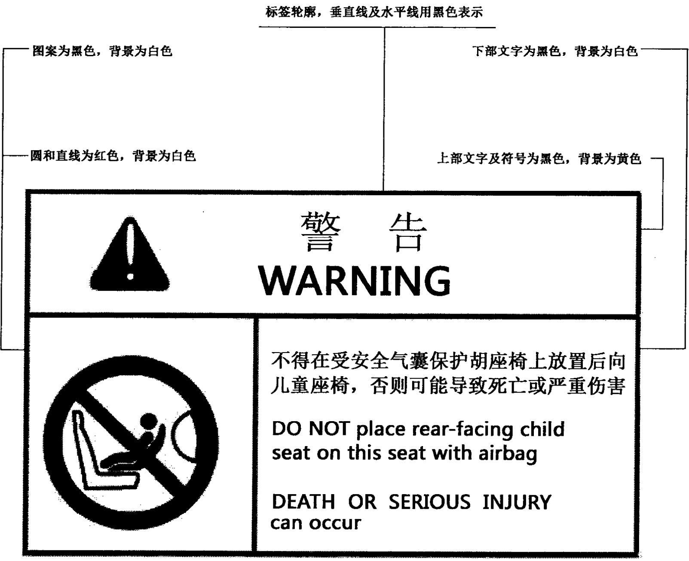  
图1警告标签样式和内容

## 4.2技术要求

4.2.1若车辆按照GB/T 20913—2007 的规定进行试验,且符合GB/T 20913—2007中4.2的规定，则认为该车辆符合4.2的要求。对于N类汽车以及多用途货车,本标准4.2.2中b)、c)以及e)的规定不做要求。

4.2.2对于处于前排外侧座位的假人,按照附录B所确定的性能指标应符合下列要求：

a）头部性能指标(HPC)应不大于1000,并且头部合成加速度大于80g的时间,累积不应超过3ms,但不包括头部反弹；

b）颈部伤害指标(NIC)应不大于图2和图3限值曲线；

c）颈部对Y轴弯矩在伸张方向应不大于57N·m;

d） 胸部压缩指标(ThCC)应不大于75 mm;

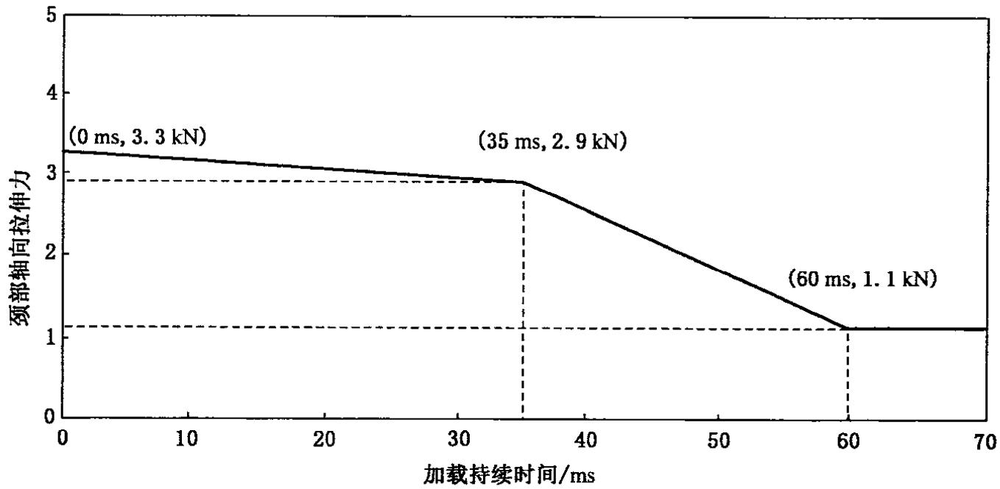

图2颈部伸张指标图  
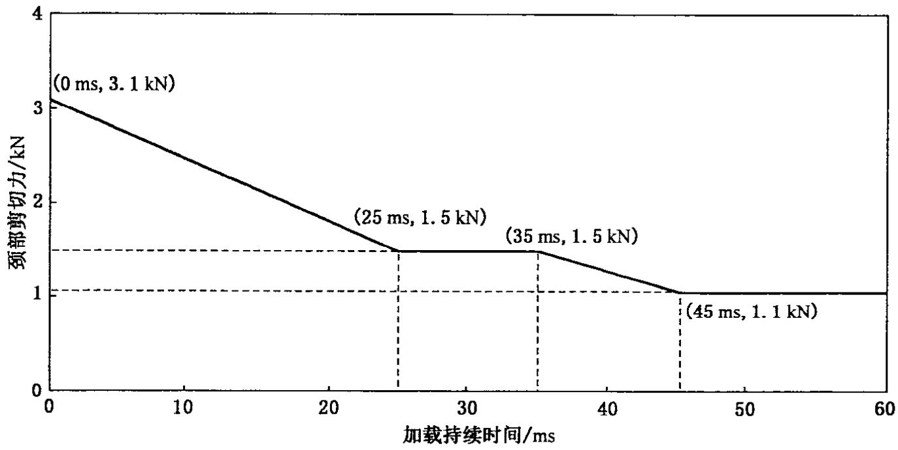

图3颈部剪切指标图  
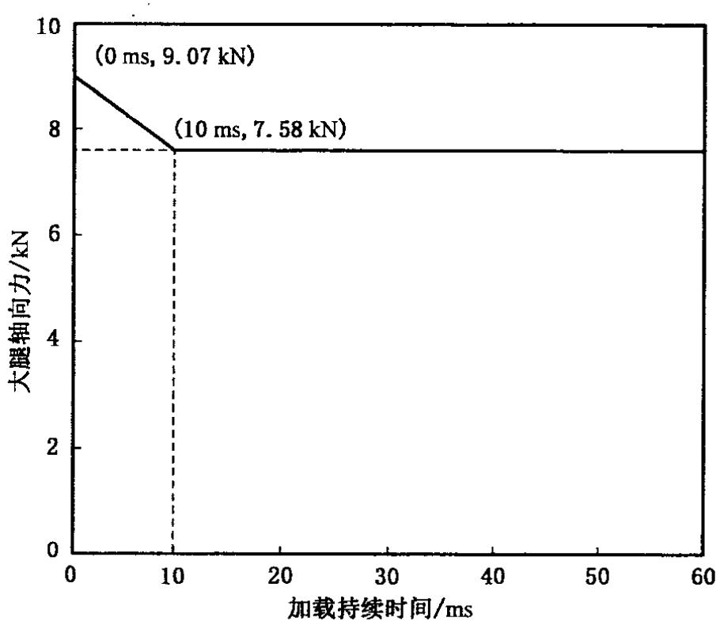  
图4大腿压缩力指标图

e） 胸部黏性指标(V·C)应不大于1.0 m/s;

f）大腿压缩力指标(FFC)应不高于图4所示的性能指标曲线。

4.2.3在试验过程中，车门不得开启。

4.2.4在试验过程中,前门的锁止系统不得发生锁止。

4.2.5碰撞试验后,除支持假人质量的必要的工具之外,不使用其他工具,应能：

-对应于每排座位,若有门,至少有一个门能打开。如果没有门,移动座椅或改变座椅靠背位置使得所有乘员能够撤离(本要求仅适用于硬顶结构的车辆)。

-将假人从约束系统中解脱时,如果发生了锁止,通过在松脱装置上施加不超过60N的压力，该约束系统应能被打开。

不调整座椅,从车辆中完好地取出假人。

4.2.6在碰撞过程中,燃油供给系统不应发生泄漏。

4.2.7碰撞试验后，若燃油供给系统存在液体连续泄漏，则在碰撞后前5min平均泄漏速率不得大于30g/min;如果来自燃油供给系统的液体与来自其他系统的液体混合，且不同的液体不容易分离和辨认，则在评定连续泄漏时，收集到的所有液体都应计人。

## 5试验方法

## 5.1设施及车辆准备

## 5.1.1试验场地

试验场地应足够大,以容纳跑道、壁障和试验必需的技术设施。在壁障前至少5m 的跑道应水平、平坦和光滑。

## 5.1.2壁障

壁障由钢筋混凝土制成，前部宽度不小于3m,高度不小于1.5m。壁障厚度应保证其质量不低于7×10\*kg。壁障前表面应铅垂，其法线应与车辆直线行驶方向成0°夹角，且壁障表面应覆以20mm±1mm厚、状态良好的胶合板（见图5)。如果有必要,应使用辅助定位装置将壁障固定在地面上，以限制其位移。

## 5.1.3壁障的定位

壁障的方位应使碰撞角为0°。

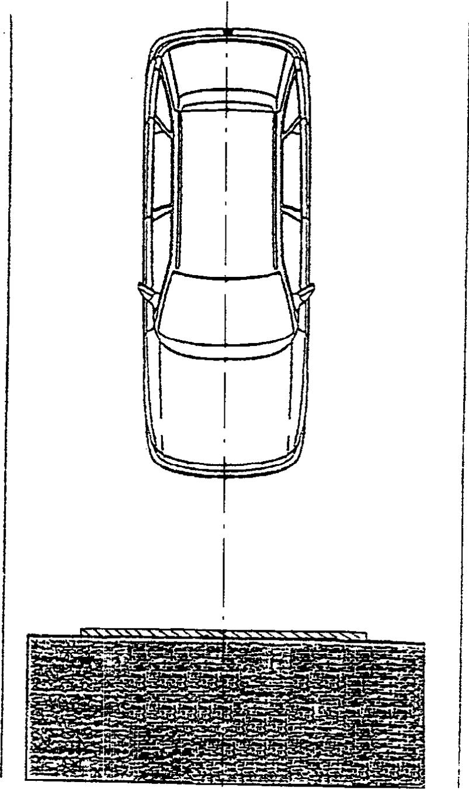  
图5带胶合板的0°壁障

## 5.1.4车辆状况

## 5.1.4.1一般要求

试验车辆应能反映出该系列产品的特征,应包括正常安装的所有装备，并应处于能够正常运行的状态。一些零部件可以被等质量代替物代替,但要求这种替换不应对5.6的测量结果有影响。

## 5.1.4.2车辆质量

5.1.4.2.1对于 $\mathbf { M } _ { 1 }$ 类车辆，提交试验的车辆质量应是整备质量。对于 ${ \bf N } _ { 1 }$ 类车辆，提交试验的车辆质量应是整备质量加上136kg或其额定载货量的质量(取其中较小的)作为配重，配重应牢固地安装在其载货区域内。

5.1.4.2.2燃油箱应注入水，水的质量为制造厂规定的燃油箱满容量时燃油质量的90%，偏差±1%。

5.1.4.2.3所有其他系统(制动系、冷却系等)应排空，排出液体的质量应予以补偿。

5.1.4.2.4如果车载测量装置的质量超过25kg,可以通过减少一些对5.6 的测量结果无明显影响的零件来进行补偿。

5.1.4.2.5车载测量装置使各轴轴荷的变化不大于5%,每轴变化不超过 20 kg。

5.1.4.2.65.1.4.2.1规定的车辆质量应在试验报告中标明。

## 5.1.4.3乘员舱的调整

## 5.1.4.3.1转向盘位置

若转向盘可调,则应调节到制造厂规定的位置，如果制造厂没有规定，则应调节到可调范围的中间位置。在加速过程结束时，转向盘应处于自由状态，且处于制造厂规定的车辆直线行驶时的位置。

## 5.1.4.3.2玻璃

车辆上的活动玻璃应处于关闭位置。为便于试验测量,经制造厂同意,可以放下活动玻璃，只要此时操纵手柄的位置相当于玻璃关闭时所处的位置。

## 5.1.4.3.3 变速杆

变速杆应处于空挡位置。

## 5.1.4.3.4踏板

踏板应处于正常的位置。若踏板可调，应放于中间位置,除非制造厂对该位置有特殊要求。

## 5.1.4.3.5车门

车门应关闭但不锁止。

## 5.1.4.3.6活动车顶

如果安装有活动车顶或可拆式车顶,它应处于应有位置并关闭。为便于试验测量，经制造厂同意，可以打开。

## 5.1.4.3.7遮阳板

遮阳板应处于收起位置。

## 5.1.4.3.8后视镜

内后视镜应处于正常的使用位置。

## 5.1.4.3.9扶手

前后座椅扶手若可移动，则应处于放下位置，除非受到车内假人的限制。

## 5.1.4.3.10头枕

高度可调节的头枕应处于最高位置。

## 5.1.4.3.11座椅

## 5.1.4.3.11.1 前排座椅位置

对于纵向可调节的座椅,应使H点(按照附录A规定的程序确定)位于行程的中间位置或最接近于中间位置的锁止位置，并处于制造厂规定的高度位置(假如高度可以单独调节)。对于长条座椅，应以驾驶员位置的H点为基准。当假人不能正确安放并且驾驶员座椅或前排乘客座椅的设计H点（x1，z)符合式(1)(即该点落在图6直线A的左侧区域内)时，允许对该座椅进行适当的调节，直到假人可以正确安放为止，以便使该设计H点位于图6中平面坐标系直线A的右侧且尽可能地接近直线A。

$$
X < { \frac { 1 \ 6 7 0 - Z } { 1 . 9 4 } }\tag{····( 1}
$$

式中：

X——通过加速踏板表面设计中心并且垂直于车辆纵向中央平面的水平直线与设计H点间在前后方向上的水平距离,单位为毫米（mm）。

-通过加速踏板表面设计中心并且垂直于车辆纵向中央平面的水平直线与设计H点间在上下方向上的垂直距离，单位为毫米（mm）。

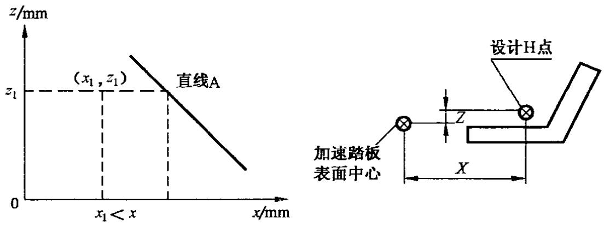  
图6H点相对位置图

## 5.1.4.3.11.2 前排座椅靠背位置

如果可调，座椅靠背应调节到使假人躯干倾角尽量接近制造厂规定的正常使用角度，若制造厂没有规定，则应调节到从铅垂面向后倾斜25°角的位置。

## 5.1.4.3.11.3后排座椅

如果可调，后排座椅或后排长条座椅应处于最后位置。

## 5.2假人

5.2.1按照附录C的规定，在每个前排外侧座椅上，安放一个符合要求的假人，假人应符合50%HybridⅢ假人技术要求及相应调整要求。为记录必要的数据以便确定性能指标，假人应配备符合附录D技术要求的测量系统。

5.2.2试验时，使用制造厂设置的约束系统。

## 5.3车辆的驱动

5.3.1车辆不应靠自身动力驱动。

5.3.2在碰撞瞬间，车辆应不再承受任何附加转向或驱动装置的作用。

5.3.3车辆到达壁障的路线在横向任一方向偏离理论轨迹均不应超过150mm。

## 5.4试验速度

在碰撞瞬间,车辆速度应为50km/h。如果试验在更高的碰撞速度下进行并且车辆符合要求，也认为试验合格。

## 5.5对前排座椅假人的测量

5.5.1为确定性能指标必需的所有测量，均应采用符合附录D要求的测量系统。

5.5.2不同的参数应通过具备下列CFC(通道的频率等级)的独立数据通道来记录。

## 5.5.2.1 对假人头部的测量

重心处的加速度(a)由加速度的三维分量计算得出。加速度分量测量时,CFC为1000。

## 5.5.2.2对假人颈部的测量

5.5.2.2.1 在头颈连接处测量的轴向张力和前后剪切力,CFC为1000。

5.5.2.2.2 在头颈连接处测量的对Y轴的弯矩,CFC为 600。

## 5.5.2.3对假人胸部的测量

胸部变形测量时，CFC为180。

5.5.2.4对假人大腿的测量

轴向压缩力测量时，CFC为600。

## 5.6在车辆上所进行的测量

5.6.1进行附录E所规定的简化试验时，车身结构减速度时间历程应以车辆左侧"B"柱下端的纵向加速度传感器的读数为基础确定，采用符合附录D要求且CFC为180 的数据通道。

5.6.2附录E所规定的简化试验程序中所使用的速度时间曲线应从车辆左侧“B"柱下端的纵向加速度传感器获得。

## 6 车辆型式的变更和扩展

影响结构、座椅数量、内饰或装备,或者可能影响车辆前部吸能特性的车辆操纵件或机械部件位置的任何变更均应通知车辆主管部门。车辆主管部门应采取下列处理方式之一：

a）认为已做的变更没有明显的不利影响，并且在任何情况下车辆仍能满足本标准的要求；

b） 按照变更的特征,要求负责进行试验的检验机构进行下列试验之一：

1）影响车辆结构基本型式和/或车辆质量变化大于8%的任何变更，根据检验机构的判定，认为对试验结果产生明显影响，应重复第5章所规定的试验；

2）若变更仅涉及内部装备、质量变化不大于8%,且车辆上最初提供的前排座位数保持不变，则应进行下列试验：

附录E所规定的简化试验,和/或；

针对所作的变更，由检验机构确定的部分试验。

## 7标准实施的过渡期要求

7.1对于新申请型式批准车型，自标准发布之日起1年后开始执行，其中 $\mathbf { N _ { i } }$ 类汽车和多用途货车自标准发布之日起2年后开始执行。

7.2对于在生产车型,自标准发布之日起3年后开始执行。

# 附录A

（规范性附录）

# 乘坐位置H点和实际靠背角的确定程序

## A.1概述

本附录所述程序用于确定汽车中一个或几个乘坐位置的H点和实际靠背角，以及检验测量数据与车辆制造厂给定的设计技术要求之间的关系。)

## A.2名词解释

A.2.1

基准数据reference data

某一乘坐位置的下列一个或几个特征：

-H点和R点以及它们的关系；

-实际靠背角和设计靠背角以及它们的关系。

A.2.2

三维H点装置 three-dimensional H point machine

3-DH装置

用于确定H点和实际靠背角的装置(见图A.1)。对该装置的描述见A.5。

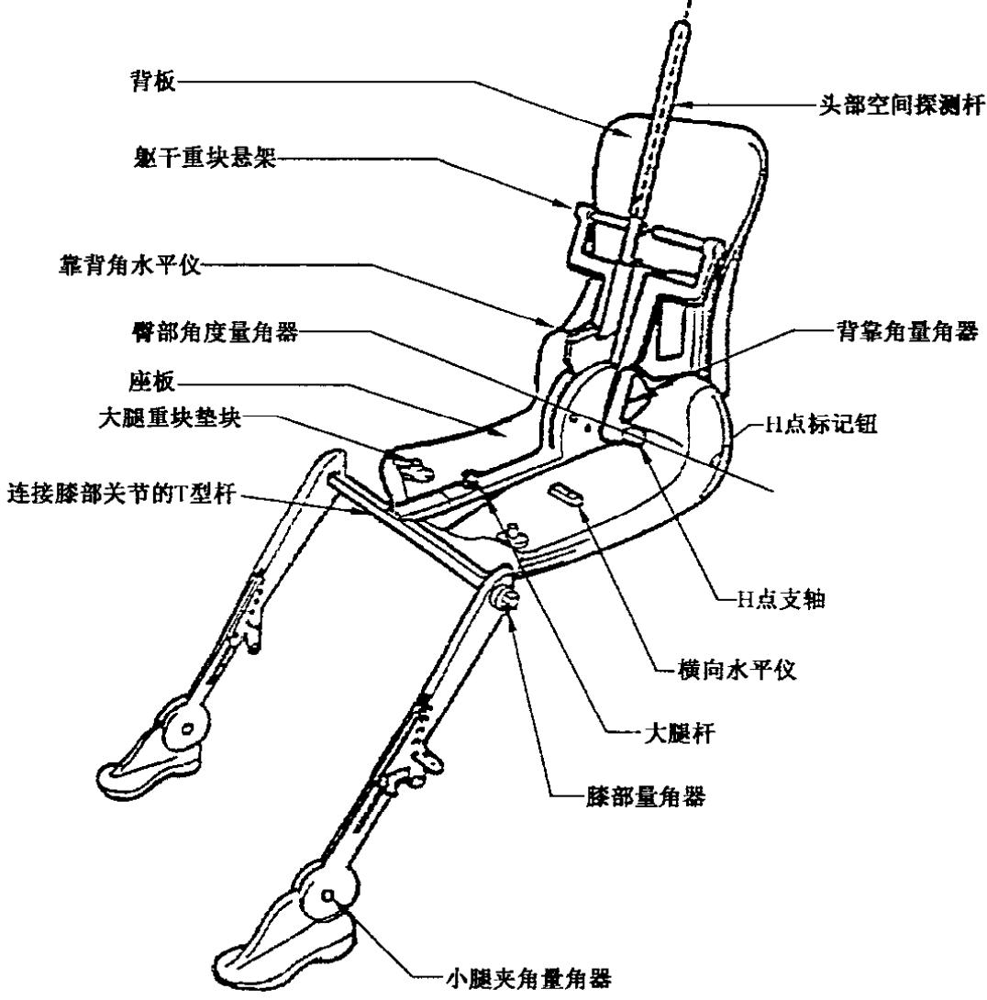  
图A.1 3-DH装置构件名称

## A.2.3

## H点 Hpoint

按A.4规定的安放在车辆座椅中的3-DH装置的躯干与大腿的铰接中心。H点位于该装置两侧H点标记钮中心线的中点。在理论上H点与R点一致(允差见A.3.2.2)。如果按A.4规定的程序确定，即认为H点相对座椅垫结构是固定的，且随座椅的调节而移动。

## A.2.4

## R点 R point

乘坐基准点 seating reference point

由车辆制造厂为每一乘坐位置规定的设计点,相对于三维坐标系来确定。

## A.2.5

## 躯干线torso-line

3-D H装置的探测杆处于最后位置时探测杆的中心线。

## A.2.6

## 实际靠背角 actual torso angle

过H点的铅垂线与躯干线之间的夹角，用3-DH装置的背部角量角器测量。理论上实际靠背角与设计靠背角相一致(允差见A.3.2.2)。

## A.2.7

设计靠背角 design torso angle

过R点的铅垂线与车辆制造厂规定的座椅靠背设计位置所对应的躯干线之间的夹角。

## A.2.8

## 乘员中心面 center plane of occupant

C/LO

放置在每一指定乘坐位置上的3-DH装置的中心面，用H点在Y轴上的坐标表示。对于单人座椅，座椅中心面即为乘员中心面；对于其他座椅，乘员中心面由制造厂规定。

## A.2.9

## 三维坐标系 three-dimensional reference system

A.6描述的系统。

## A.2.10

## 基准标记 fiducial marks

由制造厂在车身上确定的点(孔、面、标记或压痕)。

## A.2.11

## 车辆测量位置 vehicle measuring attitude

由基准标记在三维坐标系中的坐标所确定的车辆位置。

## A.3要求

## A.3.1数据的提供

为表明符合本标准规定，对要求提供基准数据的每一乘坐位置，应按A.7规定的格式提供下述全部或适当选择的数据。

A.3.1.1 R点在三维坐标系中的坐标。

A.3.1.2设计靠背角。

A.3.1.3将座椅调节到(如果可调)A.4.3规定的测量位置而需要的全部数据。

## A.3.2测量数据与设计要求之间的关系

A.3.2.1通过A.4规定的程序所获得的H点坐标和实际靠背角值应分别同制造厂给出的R点坐标和 设计靠背角值进行比较。

A.3.2.2如果由坐标确定的H点位于水平与铅垂方向边长均为50mm且对角线交于R点的正方形内,并且实际靠背角偏离设计靠背角小于5,对于上述乘坐位置,应认为R点与H点的相对位置以及设计靠背角与实际靠背角的相对关系满足要求。

A.3.2.3若符合上述条件,则应该采用该R点和设计靠背角来证明符合本标准的规定。

A.3.2.4如果H点或实际靠背角不符合A.3.2.2的要求，则再重新确定2次(共3次)。如果这2次的结果符合要求，则A.3.2.3规定的条件适用。

A.3.2.5如果A.3.2.4所描述的3次操作中至少有2次的结果不符合A.3.2.3的要求,或由于车辆制造厂未提供有关R点位置或设计靠背角的数据，而使检验无法进行时，则应取3次测量点的形心或3次测量角的平均值用于本标准涉及R点或设计靠背角的所有场合。

## A.4H点和实际靠背角确定程序

A.4.1按制造厂的要求,车辆应在 $2 0 \mathrm { ~ \textbar { ~ } C \pm 1 0 ~ \mathrm { ~ \textbar { ~ } C ~ } }$ 条件下进行预处理，以确保座椅材料达到室温。如果被检测的座椅从未有人坐过,则应让70kg～80kg的人或装置在座椅上试坐两次，每次1min,使座垫和靠背产生应有的变形。如果制造厂有要求，在安放3-DH装置前，所有座椅总成应保持空载至少30 min。

A.4.2车辆应处于A.2.11所定义的测量状态。

A.4.3首先应将座椅调节到(如果可调的话)车辆制造厂规定的最后正常驾驶或乘坐位置,仅考虑座椅的纵向调节，不包括用于正常驾驶或乘坐位置以外目的的座椅行程。若存在其他座椅调节方式（如垂直、角度、座椅靠背等)，应将它们调至车辆制造厂规定的位置。对于悬挂式座椅，则应将竖向位置刚性地固定在制造厂规定的正常驾驶位置。

A.4.43-DH装置接触的乘坐位置区应铺一块尺寸足够、质地合适的细棉布,可使用18.9根纱 $/ \cos ^ { 2 }$ 且密度为 $0 . 2 2 8 ~ \mathrm { { k g / m ^ { 2 } } }$ 的素棉布或具有相同特性的针织布或无纺布。如果在车外进行座椅试验,放置座椅的地板应与车辆内放座椅的地板有相同的基本特性。2)

A.4.5放置3-DH装置的座板和背板总成，使乘员中心面(C/LO)与3-DH装置中心面重合。如果3-D H装置放得太靠外，以致处于座椅的边缘而使3-DH不能水平时，应制造厂的要求，可以将3-DH装置相对C/LO 向内移动。

A.4.6把脚和小腿总成安装到底板总成上，可单独安装,也可以利用T形杆和小腿总成装。通过两 H点标记钮的直线应平行于地面并垂直于座椅的纵向中心面。

A.4.73-DH装置双脚和腿的调整

A.4.7.1 驾驶员和前排外侧乘客

A.4.7.1.1向前移动双脚和腿总成,使双脚自然放在地板上,必要时放在各操纵踏板之间。如果可能的话，使左、右脚至3-DH装置中心面的距离大致相等。必要时重新调整座板或向后调整腿和脚总成，使检验3-DH装置横向定位的水准仪水平。通过两H点标记钮的直线应与座椅纵向中心面保持垂直。

A.4.7.1.2如果左腿与右腿不能保持平行，并且左脚不能落地，则应移动左脚使之落地。通过两标记钮的直线仍应保持垂直于座椅纵向中心面。

## A.4.7.2后排外侧乘客

对于后排座椅或辅助座椅，双腿位置按制造厂的规定调整。如果两脚落在地板上高度不同的部位上，应以先与前排座椅接触的脚作为基准来放置另一只脚,使该装置座板上的横向水平仪指示水平。

## A.4.7.3 其他指定的乘坐位置

应遵循A.4.7.1规定的一般程序,但脚的放置应按车辆制造厂的规定进行。

A.4.8装上小腿和大腿重块并调平3-D H装置。

A.4.9将背板前倾到前限位块,用T形杆将3-DH装置拉离座椅靠背,然后再用下列方法之一,将3-DH装置重新放到座椅上。

A.4.9.1如果3-DH装置有向后滑动的趋势，使用下列程序：允许3-DH装置向后滑动，直到不需要在T形杆上施加水平向前的保持力为止（即直到背板接触到靠背为止)。必要时，重新放置小腿。

A.4.9.2 如果3-DH装置无向后滑动的趋势，使用下列程序：在T形杆上施加一水平向后的力使3-DH装置向后滑动，直到座板接触到座椅靠背为止(见图A.2)。

A.4.10 在臀部角度量角器和T形杆外壳相交处,对3-D H装置的背板和座板总成施加100N±10N的力。力的施加方向应沿一条通过上述交点到大腿杆外壳上面的直线(见图A.2)。然后将背板小心地放回靠背上。在下述操作步骤中要处处小心,以防止3-DH装置向前滑动。

单位为毫米

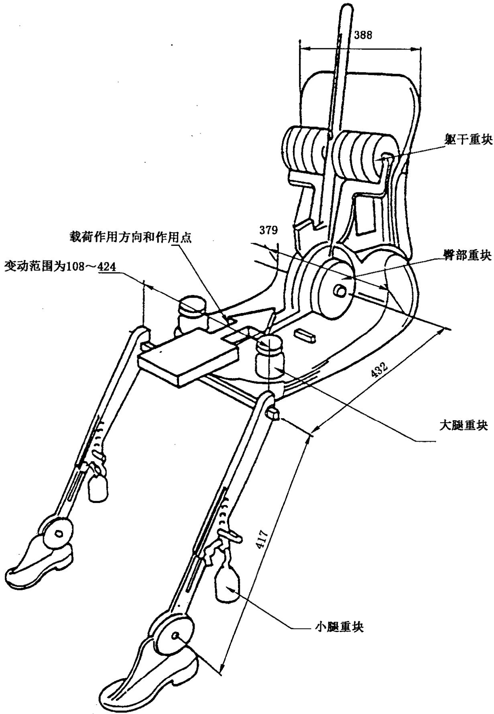  
图A.23-DH装置构件尺寸和负荷分布

A.4.11 装上左右臀部重块，然后交替加上8块躯干重块,保持3-DH装置水平。

A.4.12将背板前倾以消除对座椅靠背的张力。在10°角(自铅垂中心面向两侧各5)的范围内，左右摇动3-DH装置3个来回，以消除3-DH装置与座椅之间聚集的摩擦。在摇动过程中，3-DH装置的T形杆可能离开规定的水平和垂直基准位置，所以，在摇动期间应对T形杆施加适当的侧向力。在握住T形杆摆动3-DH装置时,应小心谨慎，以避免在垂直或前后方向施加意外的力。进行上述操作时，3-D H装置的双脚不应受任何约束。如果双脚变动位置，可暂时不必调整。

将背板放回座椅靠背上，检查两个水准仪是否水平。在摇动3-DH装置的过程中，如果双脚移动了位置，应重新进行如下调整：

a）将左、右两脚轮流抬离地板到最小的必要高度，直至两脚不再产生附加的牵动。在抬脚的过程中，两脚要能自由转动；不施加任何向前或侧向的载荷。当每只脚放回到放下位置时，装置踵部应触及为之设计的支承结构上。

b）检查横向水准仪是否水平;如果必要,在背板顶部施加一侧向力使3-DH装置座板在座椅上保持水平。

A.4.13拉住T形杆，使3-DH装置在座垫上不能向前滑移,继续操作如下：

a） 将背板放回到座椅靠背上；

b） 大约在3-DH装置躯干重块中心高度处,对靠背角杆(头部空间探测杆)交替施加和撤去不大于25N的向后水平力，直至力撤去后臀部角量角器指示达到稳定位置为止。此时应确保无外来向下或横向力加在3-DH装置上。如果3-DH装置需要再次调平，则应向前转动背板，并重复A.4.12起所述之步骤。

## A.4.14测量

A.4.14.1 在三维坐标系内测量H点坐标。

A.4.14.2当探测杆处于最后位置时，在3-DH装置的背部角量角器上读出实际靠背角的值。

A.4.15 如果需要重新安装3-DH装置，则在重新操作前，座椅总成应保持至少30min的空载状态。

A.4.16如果认为同一排座椅是一样的(如长条座椅、相同座椅等)，每排只确定一个H点和一个实际靠背角。将3-DH装置安放在该排有代表性的位置上，该位置应是：

A.4.16.1 对于第一排：驾驶员座椅。

A.4.16.2对于其他排：某一外侧座椅。

## A.5三维H点装置描述）(3-DH装置）

## A.5.1背板和座板

背板和座板用增强塑料和金属制成。它们模拟人体的躯干和大腿，两者机械地铰接于H点处。一个量角器固定在铰接于H点的探测杆上，用于测量实际靠背角。固定在座板上的可调节大腿杆确定大腿中心线，并作为臀部角量角器的基准线。

## A.5.2躯干和小腿部件

小腿杆件在连接膝部的T形杆处与座板总成相连，该T形杆是可调大腿杆的横向延伸。在小腿杆上装有量角器，以便测量膝部角。鞋和脚总成上刻有度数，用来测量脚部角。两个水平仪确定装置的空间位置，躯干各重块放在对应部位重心处，用以提供76kg男子对座椅相同的压力。应检查3-DH装置的所有关节是否活动自如无明显的摩擦阻力。

3）有关3-D H装置结构的详细资料可向美国汽车工程师学会（SAE)索取。400 Commonwealth Drive,Warrendale.,Pennsylvania 15096,U.S.A。

## A.6三维坐标系

A.6.1三维坐标系用车辆制造厂设立的3个正交平面来定义(见图A.3)。4)

A.6.2车辆测量姿态由车辆在支承面上的放置位置确定，放置车辆时使基准标记的坐标与制造厂给定的值一致。

A.6.3确定R点和H点相对于车辆制造厂给定的基准标记的坐标。

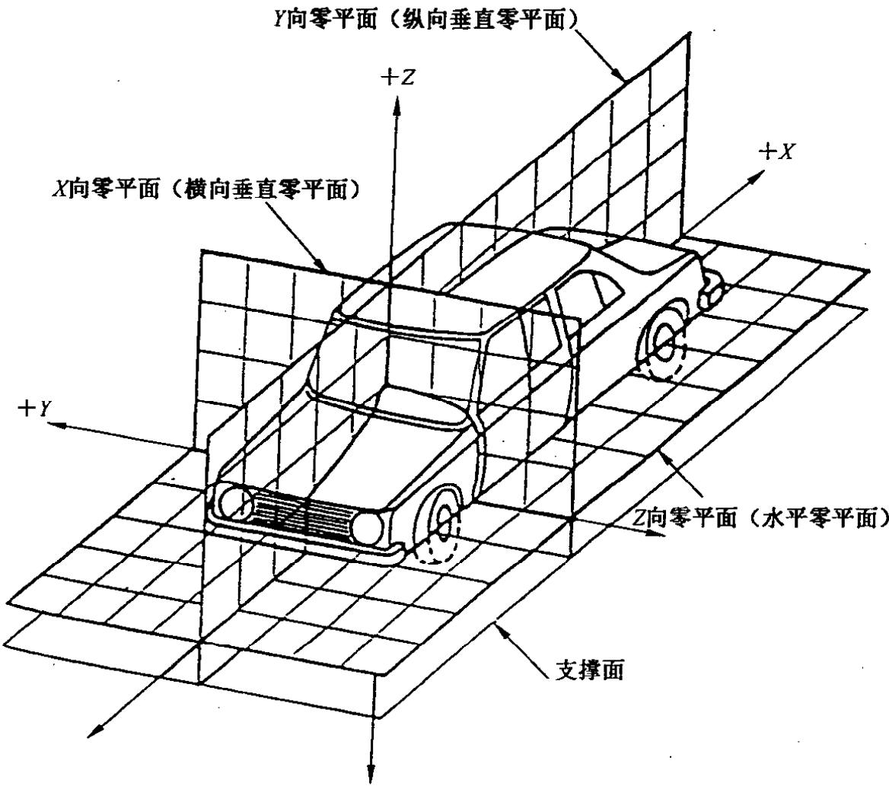  
图A.3三维坐标系

## A.7有关乘坐位置的基准数据

## A.7.1基准数据代码

按顺序列出每一乘坐位置的基准数据。乘坐位置用两位代码表示。第一位是指明从前向后计数座椅排数的阿拉伯数字。第二位是指明该乘坐位置在某一排内位置的大写字母。当沿车辆向前行驶方向观察时，用下列字母表示：

L：左侧；

C：中间；

R:右侧。

## A.7.2车辆测量姿态的描述

各基准标记的坐标。

X....

Y.....

Z......

## A.7.3基准数据表一 一乘坐位置

## A.7.3.1 R点坐标

X.·...   
Y.....   
Z......

## A.7.3.2 设计靠背角

## A.7.3.3 座椅调节技术要求)

水平：

铅垂：

角度：

靠背角：

注：其余乘坐位置基准数据可从A.7.3.2、A.7.3.3等往后罗列。

## 附录B

## （规范性附录）

## 性能指标的确定

## B.1头部性能指标(HPC)

B.1.1在试验过程中，如果头部与车辆任何部件不发生接触，则认为符合要求。

B.1.2如果发生头部与车辆部件接触，则应根据5.5.2.1所测得的加速度(a,用g来表示),按式(B.1)计算 HPC值。

$$
\mathrm { H P C } = ( t _ { 2 } - t _ { 1 } ) \lbrack \frac { 1 } { t _ { 2 } - t _ { 1 } } \rbrack _ { t _ { 2 } } ^ { t _ { 1 } } a \mathrm { d t } \rbrack ^ { 2 . 5 }\tag{··( B.1}
$$

式中：

$_ { a }$ 按照5.5.2.1测量出的合成加速度，用 $\pmb { g }$ 来表示(1 $g = 9 . 8 1 \ \mathrm { m } / \mathrm { s } ^ { 2 } )$

$t _ { 2 } - t$ 如果能够确定头部起始接触时刻，那么 $\pmb { t } _ { 1 }$ 和 $\pmb { t _ { 2 } }$ 为两个时刻，单位为秒(s)，表示头部接触起点与记录结束两个时刻之间的某一段时间间隔，在该时间间隔内HPC值应为最大。如果不能确定头部起始接触时刻，那么 $t _ { 1 }$ 和 $t _ { 2 }$ 为两个时刻，单位为秒(s)，表示记录开始与记录结束两个时刻之间的某一段时间间隔，在该时间间隔内HPC值应为最大。 $t _ { 2 } - t _ { 1 } { \leqslant } 3 6 { \mathrm { ~ m s } }$

B.1.3在前向碰撞中头部的合成加速度累积超过3ms的数值由按照5.5.2.1测量出的合成头部加速度计算出。

## B.2颈部伤害指标(NIC)

B.2.1由在头颈连接处测量的轴向压力、张力 $( F _ { z } )$ 和前后向剪切力 $( F _ { x } )$ 确定，单位为千牛(kN)，按5.5.2.2测量，时间以ms计。

B.2.2颈部弯矩指标 $( M _ { Y } )$ 由在头颈连接处的绕Y轴按5.5.2.2测出的弯矩确定，单位为牛米 $( \mathbf { N } \cdot \mathbf { m } )$

B.2.3以 N·m为单位的颈部弯矩应记录下来。

B.2.4颈部对Y轴在伸张方向的弯矩计算见式(B.2)。

$$
M _ { Y } - F _ { X } \cdot d
$$

式中：

d -传感器中心到头颈交界面的距离 $\left( d = 0 . 0 1 7 \ 7 8 \right)$

B.3胸部压缩指标(ThPC)和黏性指标 $( V \cdot C )$

B.3.1按照5.5.2.3规定测量胸部变形的绝对值，表示胸部压缩指标，单位为毫米（mm)。

B.3.2黏性指标 $( V \cdot C )$ 按照B.5和5.5.2.3测量出的胸部变形的即时压缩量与变形率的乘积计算得出，单位为米每秒 $\bf ( m / s )$

## B.4大腿压缩力指标(FFC)

按照5.5.2.4规定测量轴向传递至假人每条大腿的压力，表示大腿压缩力指标，单位为千牛（kN)，时间以 ms计。

## B.5计算假人胸部黏性指标 $( V \cdot C )$ 的方法

B.5.1黏性指标由胸骨的即时压缩量和变形率的乘积算出。这两个值都从测量的胸部变形量得出。

B.5.2胸部变形响应按CFC180 滤波。对时间的变形由此滤波数据按照 $\smash { C _ { ( t ) } = D _ { ( t ) } / 0 . 2 2 9 }$ 计算。对时间的胸部变形速度由滤波变形量按式(B.3)计算。

$$
V _ { \ u { t } } ) = \frac { 8 [ D _ { \ u { \tau } ( t + 1 ) } - D _ { \ u { \tau } ( t - 1 ) } ] - [ D _ { \ u { \tau } ( t + 2 ) } - D _ { \ u { \tau } ( t - 2 ) } ] } { 1 2 \delta _ { t } }\tag{···( B.3}
$$

式中：

$D _ { ( \varepsilon ) }$ -对时间的变形量，单位为米（m)；

$\delta _ { \iota }$ -测量变形量的时间间隔，单位为秒 $( \mathbf { s } ) , \delta _ { t }$ 的最大值为 $1 . 2 5 \times 1 0 ^ { - 4 } \mathrm { ~ s ~ }$

计算流程见图B.1：

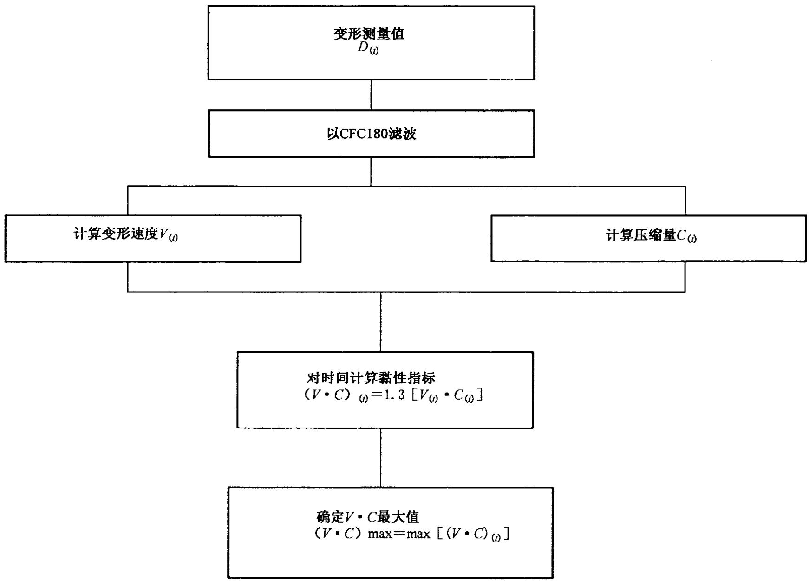  
图B.1假人胸部黏性指标计算流程

# 附录C（规范性附录）假人的布置和约束系统的调整

## C.1假人的布置

## C.1.1单人座椅

假人的对称平面应与座椅铅垂中间平面重合。

## C.1.2前排长条座椅

## C.1.2.1驾驶员

假人的对称平面应位于通过转向盘中心且平行于车辆纵向中心平面的铅垂平面上。若乘坐位置由长条座椅形状来确定，则这样的座椅应视为单人座椅。

## C.1.2.2外侧乘客

假人的对称平面与驾驶员侧假人的对称平面应相对于车辆纵向中心平面对称。若乘坐位置由长条座椅形状来确定，则这样的座椅应视为单人座椅。

## C.1.3前排乘客(不包括驾驶员)长条座椅

假人的对称平面应与制造厂规定的乘坐位置的中间平面重合。

## C.2假人的安放

## C.2.1头部

头部传感器安装平面应是水平的，偏离角度在2.5以内。为了在装备靠背不可调的直立座椅的车辆上使假人头部水平，应按下列顺序操作：首先在B.2.4.3.1规定的范围内调节H点位置，以使假人头部传感器安装平面水平；若头部的传感器安装平面仍不水平，则在C.2.4.3b)规定的范围内调节假人的骨盆角度。若还未水平，则调节假人颈部支撑，调节量尽量小，使传感器安装平面与水平面的偏离在2.5°内。

## C.2.2手臂

C.2.2.1驾驶员侧假人的上臂应贴近躯干，其中心线应尽量接近铅垂平面。

C.2.2.2乘客侧假人的上臂应与座椅靠背及躯干两侧相接触。

C.2.3手

C.2.3.1驾驶员侧假人的手掌应在转向盘轮缘水平中心线处和轮缘外侧相接触，拇指应放在转向盘轮缘上并用胶带轻轻粘贴，以便使假人的手在受到不超过22N且不小于9N的力向上推动时，胶带松脱，手能离开转向盘轮缘。

C.2.3.2乘客侧假人的手掌应和大腿的外侧相接触，小手指应接触到座垫。

## C.2.4躯干

C.2.4.1在装有长条座椅的车辆上，驾驶员侧和乘客侧假人的上躯干都应靠着座椅靠背。驾驶员侧假人的对称面应铅垂并平行于车辆纵向中心线，且通过转向盘轮缘中心。乘客侧假人的对称面也应铅垂并平行于车辆纵向中心线，且距车辆纵向中心线的距离与驾驶员侧假人对称面距车辆纵向中心线的距离相等。

C.2.4.2在装有单人座椅的车辆上，驾驶员侧和乘客侧假人的上躯干都应靠着座椅靠背。驾驶员及乘客假人的对称面应铅垂且与单人座椅的纵向中心线重合。

C.2.4.3下肢安放程序如下：

a）H点：驾驶员侧及乘客侧假人的H点应在一个规定点的铅垂方向和水平方向各为13mm的范围内，该点位于按附录A规定的程序所确定的H点位置下方6mm处。但当H点装置的小腿和大腿部分的长度分别调为414mm和401mm来代替432mm和417mm的这种情况除外。

b）骨盆角度：用插入假人H点测量孔中的骨盆角度量规(见图C.1)测定，与量规76.2mm平面上的水平面所成的夹角应为22.5°±2.5°。

单位为毫米

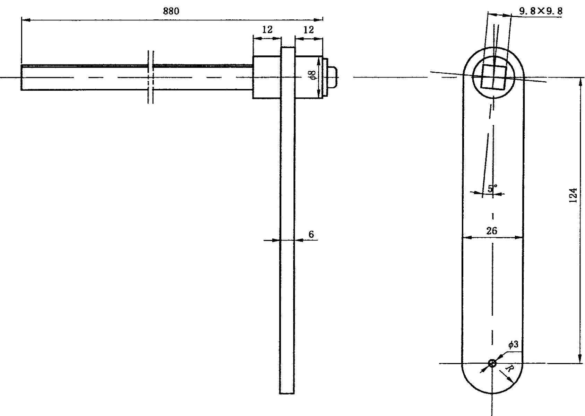  
图C.1骨盆角度量规

## C.2.5腿

通过调整假人双脚，使驾驶员侧及乘客侧假人的大腿尽可能靠着座垫。双腿膝部U形凸缘外表面之间的初始距离为270mm±10mm，在可能的情况下，尽量使驾驶员侧假人的左腿及乘客侧假人的双腿应分别处在纵向铅垂平面内。为更进一步接近实际情况，驾驶员侧假人的右腿应处于铅垂平面内。对不同的乘员舱形状，允许为适应按C.2.6放置双脚而对假人腿部位置作最后的调整。

## C.2.6脚

C.2.6.1驾驶员侧假人的右脚应放在未踩下的加速踏板上，处于地板表面上的脚跟最后点应在踏板平面内。若脚不能放在加速踏板上，则应垂直于小腿放在适当位置，且沿踏板中心线方向尽量靠前，脚跟最后点搁在地板表面上。左脚脚跟应尽量靠前放置，并搁在地板上。左脚应尽可能放在脚踏板上。左脚的纵向中心线应尽可能和车辆纵向中心线平行。

C.2.6.2乘客侧假人双脚脚跟应尽量靠前放置，并应搁在地板上。双脚应尽可能放在脚踏板上。两脚的纵向中心线应尽可能与车辆纵向中心线平行。

## C.2.7假人的运动

在碰撞过程中,车上安装的测量仪器不应影响假人的运动。

## C.2.8假人的温度

试验前,假人和测量仪器系统的温度应稳定,并保持在19℃～22℃范围内。

## C.2.9假人服装

C.2.9.1假人应穿合身的纯棉半袖上衣和短裤。

C.2.9.2假人的每只脚都应穿鞋,每只鞋重 $5 7 0 ~ \mathbf { g } \pm 1 0 0 ~ \mathbf { g }$

## C.3约束系统的调整

按C.2.1～C.2.6的规定，在指定乘坐座椅上放置假人，把安全带束缚在假人身上并扣上带扣。消除腰带的全部松弛量。从卷收器中拉出肩带织带，再使之卷回，重复操作4次。给腰带施加9N～18N拉力。若安全带系统带有拉紧一放松装置，则按制造厂在车辆用户手册中为正常使用而推荐的方式，给肩带以最大松弛量。若安全带系统不带拉紧一放松装置，允许肩带多余的织带借助卷收器的卷收力自动卷回。

# 附录D

# （规范性附录）

# 测试技术：仪器

## D.1名词解释

## D.1.1

数据通道 data channel

数据通道包括从传感器(或以某种特定方式结合在一起输出信号的复合传感器)到数据分析仪器（可以分析数据的频率成分和幅值成分)的所有设备。

## D.1.2

## 传感器transducer

数据通道的第一环节，用来将被测的物理量转换成为其他的量(如电压),以便接后处理设备。

## D.1.3

通道的幅值等级channel amplitude class

CAC

符合本附录规定的某些幅值特性的数据通道的表示方法。CAC值在数值上等于测量范围的上限。

## D.1.4

特征频率 characteristic frequencies

$F _ { \mathrm { ~ H ~ } } , F _ { \mathrm { ~ L ~ } } , F _ { \mathrm { ~ N ~ } }$ 这些频率的定义如图D.1所示。

## D.1.5

## 通道的频率等级channels frequency class

CFC

由某一数值表示，该值表明通道的频率响应位于图D.1规定的限值内。CFC值在数值上等于$F _ { \mathrm { \tiny ~ H } } ( \mathrm { \tiny ~ H } z )$ 值。

## D.1.6

灵敏度系数 sensitivity coefficient

在通道的频率等级内，采用最小二乘法对标定值拟合，所得直线的斜率即为灵敏度系数。

## D.1.7

数据通道的标定系数calibration factorof a data channel

在对数坐标上,位于F与 $F _ { \mathrm { H } } / 2 . 5$ 之间，用等间隔频率点的灵敏度系数的平均值表示。

## D.1.8

线性误差 linearity error

标定值与D.1.6定义的直线上对应读数之间的最大差值同通道幅值等级的比，用百分数表示。

## D.1.9

横向灵敏度 cross sensitivity

当一个激励施加于与测量轴线垂直的传感器上时的输出信号与输入信号的比值。该值表示为主测量轴横向灵敏度，以百分数表示。

## D.1.10

相位滞后时间phase delay time

数据通道的相位滞后时间等于某正弦信号的相位滞后[用rad(弧度)表示]除以该信号的角频率

[用rad/s(弧度/秒)表示]。

## D.1.11

## 环境 environment

在给定的时刻，数据通道所处的外部条件与受到的影响的总称。

## D.2性能要求

## D.2.1线性误差

CFC 中任何频率下数据通道的线性误差的绝对值,在整个测量范围内,应等于或小于CAC值的2.5%。

## D.2.2幅值对频率的关系

数据通道的频率响应应位于图D.1给定的限定曲线内。0dB线由标定系数确定。

## D.2.3相位滞后时间

数据通道的输入与输出信号之间的相位滞后时间，在 $0 . 0 3 F _ { \mathrm { H } }$ 与 $\boldsymbol { F } _ { \mathrm { H } }$ 之间,不应超过 $1 / ( 1 0 F _ { \mathrm { H } } ) \{$ 。

## D.2.4时间

## D.2.4.1时基

时基应予记录并至少为1/100s,精度为1%。

## D.2.4.2 相对时间延迟

两个或多个数据通道信号之间的相对时间延迟,不管何频率等级,应不超过1ms,除去因相位漂移而产生的滞后。

信号混合在一起的两个或多个数据通道应具有相同的频率等级且相对时间延迟应不超过$1 / ( 1 0 F _ { \mathrm { H } } ) { \it \Omega } _ { \mathrm { i } }$ S。

这一要求适用于模拟信号以及同步脉冲和数字信号。

## D.2.5传感器横向灵敏度

传感器横向灵敏度在任何方向应不超过5%。

## D.2.6标定

## D.2.6.1概述

数据通道用可追朔到已知标准的基准设备进行标定，每年至少1次。与基准设备进行比较的方法不应导致大于CAC的1%的误差。基准设备的使用应限定在已标定的频率范围内。数据采集系统的子系统可以单独标定，然后换算成总系统的精度。比如，可以用已知幅值的电信号模拟传感器的输出对系统进行标定，而不需要传感器。

## D.2.6.2 用于标定的基准设备的精度

基准设备的精度应由官方计量机构予以检定或确认。

## D.2.6.2.1 静态标定

## D.2.6.2.1.1加速度

误差应不超过通道幅值等级的士1.5%。

## D.2.6.2.1.2力

误差应不超过通道幅值等级的士1%。

## D.2.6.2.1.3位移

误差应不超过通道幅值等级的士1%。

## D.2.6.2.2 动态标定

## D.2.6.2.2.1加速度

基准加速度的误差表示成通道幅值等级的百分数，要求：

-400 Hz以下时不超过±1.5%；

-400Hz～900Hz时不超过±2%；

-大于900 Hz 时不超过±2.5%。

## D.2.6.2.3时间

基准时间的相对误差应不超过 $1 0 ^ { - 5 }$ Q

## D.2.6.3灵敏度系数和线性误差

测量数据通道的输出信号与已知变化幅值的输入信号的关系即可确定灵敏度系数和线性误差。数据通道的标定应覆盖整个幅值等级。

对双向幅值通道,正值、负值均应标定。

如果标定设备不能产生要求的输人，标定应该在相应标准的限值内进行，限值应记录在测试报告中。

在 $\boldsymbol { F } _ { \mathrm { L } }$ 与 $F _ { \mathrm { H } } / 2 . 5$ 之间，整个数据通道应在有重要值的频率处或某一段频率范围内进行标定。

## D.2.6.4频率响应的标定

幅频特性和相频特性由数据通道的输出信号与已知输人信号的关系确定，输人信号在 $\boldsymbol { F } _ { \textup { L } }$ 与10倍的 CFC或3000 Hz(取较小者)之间变化。

## D.2.7环境影响

应进行定期检查以确定环境的影响(诸如电或磁通量等)。通常可以通过记录装备模拟传感器的备用数据通道的输出来进行。如果输出信号过大，即应采取纠正措施，例如更换电线。

## D.2.8数据采集通道的选择与确定

通过CAC与CFC确定数据通道。

CAC应是1,2或 $5 \times 1 0 ^ { N }$ ,其中N为整数。

## D.3传感器的安装

传感器应刚性固定以使其记录受振动的影响尽可能小。安装的谐振频率至少为数据通道所考虑的$F _ { \mathrm { ~ H ~ } }$ 频率的5倍。尤其是加速度传感器的安装应保证实际测量轴线相对于基准轴线的偏离角不得大于5°,除非为分析安装的影响而采集数据。测量某一点的多轴向加速度时，每个加速度传感器轴线应距该点10 mm内，每个加速度计的惯性质量中心应距该点30mm 内。

## D.4记录

## D.4.1模拟磁带记录仪

带速应稳定,带速误差不超过使用带速的0.5%。在最大带速时，记录仪信噪比应不小于42dB。总谐波失真应小于3%，并且线性误差应不超过量程的1%。

## D.4.2数字式磁带记录仪

带速应稳定，带速误差不超过使用带速的10%。

## D.4.3纸带式记录仪

在直接式数据记录情况下，纸带速度（以 $\operatorname* { m m } / { \mathsf s }$ 表示)应至少为 $F _ { \mathtt { H } }$ 值(以Hz为单位)的1.5倍。在其他情况下，纸带速度应保证获得相同的分辨率。

## D.5数据处理

## D.5.1滤波

在数据记录或处理过程中，都要进行相应于数据通道的频率等级的滤波。然而，在记录之前，应进行比CFC级别高的模拟滤波，以便使用记录仪至少50%的频响范围，而且降低了记录仪器高频饱和或导致数字处理过程中的频率混淆的危险。

## D.5.2数字化

## D.5.2.1采样频率

采样频率应至少等于 $8 F _ { \mathrm { ~ H ~ } }$ 。对于模拟记录仪，当记录和回放速度不同时,采样频率能被速比整除。

## D.5.2.2幅值分辨率

数字长度至少为7位和一个符号位。

## D.6试验结果的表示

试验结果应以A4幅面纸给出。以图形表示的试验结果应有坐标轴，坐标轴采用相应于所选单位的适当倍数的测量单位来定标(如1mm,2mm,5mm,10 mm,20 mm)。应使用标准国际单位制,但车辆速度单位可以使用km/h,而碰撞加速度则可以用g来表示， $g = 9 . 8 1 \ \mathrm { m } / \mathrm { s } ^ { 2 }$

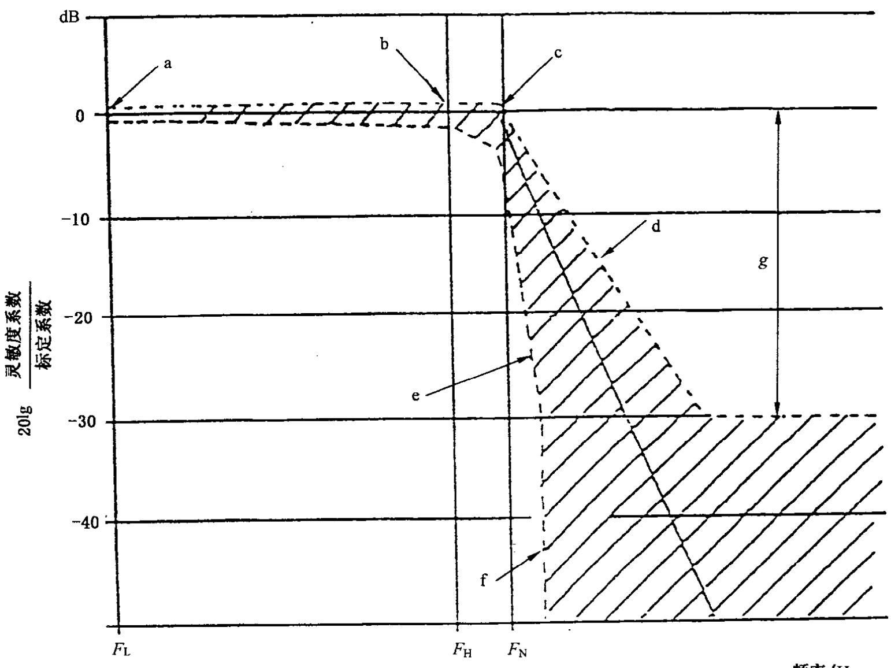

<table><tr><td rowspan=1 colspan=1>CFC</td><td rowspan=1 colspan=1> $F _ { \bot } / \mathrm { H } z$ </td><td rowspan=1 colspan=1> $F _ { \mathbb { H } } / \mathrm { H } \mathbf { z }$ </td><td rowspan=1 colspan=1> $F _ { \mathbf { N } } / \mathrm { H } \mathbf { z }$ </td><td rowspan=1 colspan=1>N</td><td rowspan=1 colspan=1>对数坐标</td><td rowspan=1 colspan=1>单位</td></tr><tr><td rowspan=2 colspan=1>1 00060018060</td><td rowspan=2 colspan=1>≤0.1≤0.1≤0.1≤0.1</td><td rowspan=2 colspan=1>100060018060</td><td rowspan=1 colspan=1>1 6501000</td><td rowspan=2 colspan=1>abCdefg</td><td rowspan=2 colspan=1>±0.5+0.5-1+0.5-419-248130</td><td rowspan=2 colspan=1>dBdBdBdb/倍频程db/倍频程dB</td></tr><tr><td rowspan=1 colspan=1>300100</td></tr></table>

图D.1频率响应曲线

# 附录E

# （规范性附录）

# 滑车试验程序

## E.1试验设备和程序

## E.1.1滑车

滑车的结构应保证试验后不发生永久变形。在碰撞过程中，导向装置应确保滑车在铅垂平面上偏移不超过5,同时在水平面上偏移不超过2°。

## E.1.2试验样件的状况

## E.1.2.1概述

试验样件应代表相关车辆的系列产品。如果确定对试验结果没有影响，可以替换或拆除某些零部件。

## E.1.2.2调整

调整应符合 5.1.4.3 的规定,并考虑 E.1.2.1的规定。

## E.1.3试验样件的固定

E.1.3.1试验样件应牢固地固定在滑车上，以确保试验过程中不发生相对位移。

E.1.3.2将试验样件固定在滑车上的方法对座椅固定点或约束装置不应有加强作用，也不应使试验样件产生异常变形。

E.1.3.3推荐采用的固定装置是将试验样件支撑在大致位于车轮轴线的支座上，如果可能，试验样件通过悬架系统的紧固件固定于滑车上。

E.1.3.4车辆纵轴线与滑车纵轴线之间的夹角为 $0 ^ { \circ } \pm 2 ^ { \circ }$ 0

## E.1.4假人

假人及其放置应符合5.2的规定。

## E.1.5测试设备

## E.1.5.1试验样件的减速度

按照附录D的规定(CFC180)，测量碰撞过程中试验样件减速度的传感器位置应平行于滑车的纵轴线。

## E.1.5.2对假人所进行的测量

为检验所列的指标，所有必要的测量应符合5.5的规定。

## E.1.6试验样件的减速度曲线

碰撞过程中试验样件的减速度曲线应保证：在任何点,由积分获得的"速度相对于时间的变化"曲线

与本附录所规定的相关车辆"速度相对于时间变化"的基准曲线相差不超过士1 $\mathbf { m } / \mathbf { s } .$ 。允许用相对于基准曲线时间轴平移的方式使得试验样件的速度曲线落在图E.1所示范围内。

## E.1.7相关车辆的基准曲线

$$
\Delta V = f ( t )
$$

该基准曲线通过相关车辆减速度曲线积分获得，而减速度曲线来自按5.6所规定的正面碰撞试验的测量结果。

## E.1.8等效试验方法

试验可以通过滑车减速度法以外的其他方法来进行，但其他方法应符合E.1.6有关速度变化范围的规定。

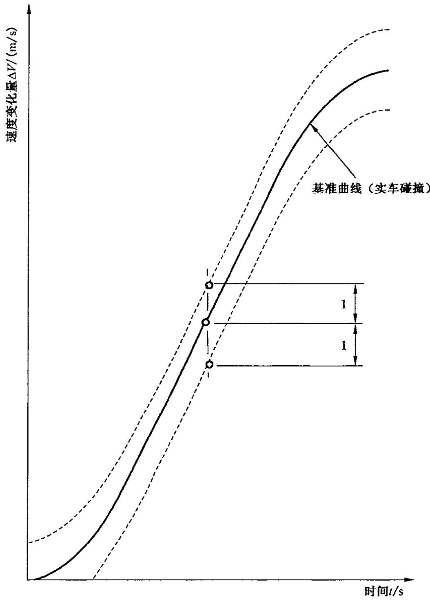  
图E.1等效曲线—曲线△V=f(t)的公差带

# 中华人民共和国

国家标准

# 汽车正面碰撞的乘员保护

GB11551—2014

中国标准出版社出版发行北京市朝阳区和平里西街甲2号(100029)北京市西城区三里河北街16号(100045)

网址 www.spc.net.cn

总编室：(010)64275323 发行中心：(010)51780235读者服务部：(010)68523946

中国标准出版社秦皇岛印刷厂印刷各地新华书店经销

开本 880×12301/16印张 2.25 字数 53千字2014年10月第一版2014年10月第一次印刷