# 中 华 人 民 共 和 国 国 家 标 准

GB 4660—2016

代替 GB 4660—2007

# 机动车用前雾灯配光性能

# Photometric characteristics of power-driven vehicle front fog lamps

2016-12-30 发布

2017-01-01 实施

## 前言

本标准的第 4章、第 5章、第 6章和第 7章内容为强制性的，其余为推荐性的。

本标准按照 GB/T 1.1—2009给出的规则起草。

本标准代替 GB 4660-2007《汽车用灯丝灯泡前雾灯》，与 GB 4660—2007相比，主要内容变化如下：

标准名称由《汽车用灯丝灯泡前雾灯》改为《机动车用前雾灯配光性能》；

B级前雾灯对应 GB 4660—2007版前雾灯，修改了测试区域和限值；

增加了 F3级前雾灯的要求、试验方法、检验规则；

增加了附录 D“F3级前雾灯明暗截止线锐度及其定义以及使用明暗截止线进行照准的程序”；

增加了附录 E“配光稳定性的点灯方式示例”；

增加了附录 F“装用 LED模块或光源发生器的有关规定”。

请注意本文件的某些内容可能涉及专利。本文件的发布机构不承担识别这些专利的责任。

本标准由全国汽车标准化技术委员会(SAC/TC 114)归口。

本标准由上海汽车灯具研究所、上海小系车灯有限公司负责起草。

本标准主要起草人:王华、费音、章世骏、何士群、童舒娜、凌铭

本标准所代替标准的历次版本发布情况为：

GB 4660—1984、GB 4660—1994、GB 4660—2007。

# 机动车用前雾灯配光性能

## 1 范围

本标准规定了机动车用前雾灯配光性能、试验方法和检验规则等。

本标准适用于 L3、L4、L5、M、N类机动车使用的各种类型前雾灯。

## 2 规范性引用文件

下列文件对于本文件的引用是必不可少的。凡是注日期的引用文件，仅注日期的版本适用于本文件。凡是不注日期的引用文件，其最新版本（包括所有的修改单）适用于本文件。

GB 4599 汽车用灯丝灯泡前照灯

GB 4785 汽车及挂车外部照明和光信号装置的安装规定

GB 15766.1 道路机动车辆灯丝灯泡尺寸、光电性能要求

IEC 60061 灯头灯座及检验其互换性和安全性（Lamp caps and holders together with gauges for the control of interchangeability and safety）

ECE R37 关于批准用于已经批准的机动车和挂车灯具中的灯丝灯泡的统一规定（Uniform provisionsconcerning the approval of filament lamps for use in approved lamp units of power-driven vehicles and of theirtrailers）

ECE R99 关于批准用于已通过认证的机动车的气体放电灯的气体放电光源的统一规定（Uniform provisions concerning the approval of gas-discharge light sources for use in approved gas- discharge lamp units of power-driven vehicles）

## 3 术语和定义

GB 4599、GB 4785、GB 15766.1 界定的术语和定义适用于本文件。

## 4 前雾灯的不同型式

在以下主要方面有差异的前雾灯：

商标名称或商标；

不同“等级”（B或 F3）；

光学系统特性［础光学设计、光源型式/类别、LED模块、分布式照明系统（DLS）等］；

通过反射、折射、吸收和/或工作时的变形，改变光学效果的部件以及可变光强控制（如有）；

装用灯丝灯泡的类别，气体放电光源和/或 LED模块,或者光源发生器特定识别码（如有）；

配光镜的材料和涂层（如有）。

但是，设计为一个安装在车辆左侧的前雾灯和另一个安装在车辆右侧的对应前雾灯应为同一型式。

## 5 要求

## 5.1 一般要求

前雾灯的设计和制造应确保在正常使用条件下，即使受到振动，仍满足使用要求和符合配光要求。前雾灯上应明确标出配光镜的正确位置。在使用过程中，配光镜及反射镜应牢固而不会发生旋转。以上要求应通过目视检验，必要时应通过装车试装确定。关于前雾灯调整还应符合以下要求：

a） 前雾灯应安装一能在车上对其进行调整的装置，以确保其符合要求。该装置不需安装在反射镜和配光镜不能分开的前雾灯上，前提是该前雾灯的使用仅限于在可通过其他方式对前雾灯进行调整的车辆上。如果装有独立光源的前雾灯和另一只前照明灯具组合成合成单元，则调整装置应能对每一个光学系统进行单独调整。

b） 然而，上述要求不适用于反射镜不可分离的前灯组合。对于这种型式的总成，应满足 5.9.2.3或5.9.3.3 的要求。

## 5.2 色度要求

前雾灯的光色应为白色或黄色，其色度特性应符合 GB 4785规定。

## 5.3 前雾灯的配光性能稳定性试验的要求

前雾灯应符合附录 A的要求。

## 5.4 “塑料配光镜前雾灯的要求——配光镜或材料试样和整灯试验”要求

5.4.1 若前雾灯的配光镜是塑料材料,还应符合附录 B的要求。

5.4.2 前雾灯中的塑料材料的透光零件应按 B.2.7进行抗 UV辐照试验。

5.4.3 对于采用符合下列要求的低 UV 辐射的光源,5.4.2规定的试验可免做：

a） ECE R99 和 GB 15766.1 的低 UV 辐射的光源；

b） 附录 C的光源；

c） 采用滤光片等措施屏蔽了 UV辐射的光源。

## 5.5 前雾灯的光源要求

## 5.5.1 使用可更换光源的前雾灯要求

5.5.1.1 光源灯头型式应符合 GB 15766.1 和 IEC 60061 与光源类别相对应的灯泡数据页。

5.5.1.2 光源应能方便的安装至前雾灯。

5.5.1.3 光源只能被安装在正确的位置。

## 5.5.2 使用 LED 模块及光源发生器的前雾灯要求

5.5.2.1 LED模块及光源发生器应只能被安装在正确的位置。

5.5.2.2 不相同的光源模块在同一灯体中不可互换。

5.5.2.3 LED模块或光源发生器应是防抖动的。

## 5.5.3 B级前雾灯的光源要求

5.5.3.1 应装有一只符合 GB 15766.1或 ECE R37规定的灯丝灯泡的要求：

a） 灯丝灯泡的基准光通量不超过 2000 lm；

b） 允许使用任一 GB 15766.1 或 ECE R37 号法规及其随后的系列修订中没有被限制的灯丝灯泡。

5.5.3.2 如果灯丝灯泡是不可更换的，也应符合 5.5.3.1的规定。

## 5.5.4 F3 级前雾灯可替换/不可替换光源要求

5.5.4.1 一只或多只符合 GB 15766.1、ECE R37 或 ECE R99 的光源。

5.5.4.2 和/或一个或多个 LED模块，应符合附录 C的要求。其符合性应通过测试确定。

5.5.4.3 和/或光源发生器，应符合附录 C的要求。其符合性应通过测试确定。

## 5.6 明暗截止线的锐度和线性要求

当照准有异议时，F3级前雾灯应按附录 D的规定对明暗截止线的锐度和线性进行检测。

## 5.7 电磁兼容性要求

前雾灯及其镇流器或电光源控制器应符合电磁兼容性要求。电磁兼容要求的一致性与具体的汽车型式有关。

## 5.8 其他要求

5.8.1 前雾灯可使用附加系统控制光强;或者与另一功能混合时，也可使用附加系统控制光强。

5.8.2 对于装用自动改变光照强度以适应浓雾及可见度下降状况的前雾灯，应满足下列要求：

a） 前雾灯功能系统中整合了一个动态电光源控制器；

b） 所有的照度值按比例修正。

## 5.9 配光性能要求

## 5.9.1 眩目性要求

前雾灯的设计应能保证充分照明且不炫目。

## 5.9.2 B级前雾灯配光性能要求

5.9.2.1 B级前雾灯测试区域如图 1所示。

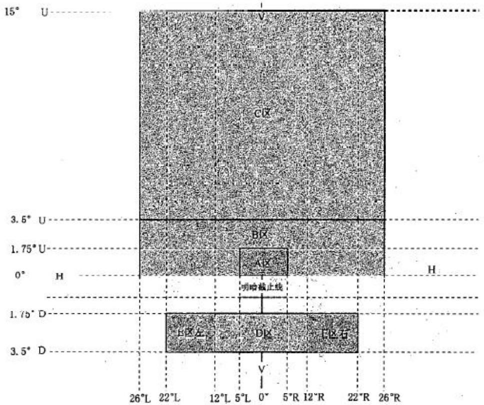  
图 1 B级前雾灯配光屏幕

5.9.2.2 光束应在照准屏幕上V-V线左右两侧超过5°的宽度范围内产生一对称且大致水平的明暗截止线以进行目视垂直调整。

5.9.2.3 照准后，B级前雾灯应符合表 1规定。

表 1 B级前雾灯配光性能要求
<table><tr><td rowspan=1 colspan=1>线或区域</td><td rowspan=1 colspan=1>垂直位置a+为H-H线上-为H-H线下</td><td rowspan=1 colspan=1>水平位置a-为V-V线左端+为V-V线右端</td><td rowspan=1 colspan=1>发光强度/cd</td><td rowspan=1 colspan=1>适用要求</td></tr><tr><td rowspan=1 colspan=1>线1</td><td rowspan=1 colspan=1>+15°到+60°</td><td rowspan=1 colspan=1>0°</td><td rowspan=1 colspan=1>≤145</td><td rowspan=1 colspan=1>整条线</td></tr><tr><td rowspan=1 colspan=1>A区</td><td rowspan=1 colspan=1>00到+1.75°</td><td rowspan=1 colspan=1>-5到+5°</td><td rowspan=1 colspan=1>≥85</td><td rowspan=1 colspan=1>整个区域</td></tr><tr><td rowspan=1 colspan=1>B区</td><td rowspan=1 colspan=1>00到+3.5°</td><td rowspan=1 colspan=1>-26到+26°</td><td rowspan=1 colspan=1>≤570</td><td rowspan=1 colspan=1>整个区域</td></tr><tr><td rowspan=1 colspan=1>C区</td><td rowspan=1 colspan=1>+3.5到+15°</td><td rowspan=1 colspan=1>-26到+26°</td><td rowspan=1 colspan=1>≤360</td><td rowspan=1 colspan=1>整个区域</td></tr><tr><td rowspan=1 colspan=1>D区</td><td rowspan=1 colspan=1>-1.75到—3.5°</td><td rowspan=1 colspan=1>-12°到+12°</td><td rowspan=1 colspan=1>≥1700≤11500</td><td rowspan=1 colspan=1>每条垂直线上至少有一点</td></tr><tr><td rowspan=1 colspan=1>E区</td><td rowspan=1 colspan=1>-1.75°到—3.5°</td><td rowspan=1 colspan=1>-22到—12和+12°到+22°</td><td rowspan=1 colspan=1>≥810≤11500</td><td rowspan=1 colspan=1>每条垂直线上至少有一点</td></tr><tr><td rowspan=1 colspan=5>a采用带极轴的球角度坐标测量网格。</td></tr></table>

5.9.2.4 B 区和 C 区不应出现为满足配光要求而产生的明显光强变化。

5.9.2.5 根据表 1所述的配光要求，可在 15°以上的区域中出现不超过 230 cd的单个点或条纹，只要单个点的锥形立体角不超过 2°或条纹的宽度不超过如有多个点或条纹出现，则它们应最小间隔 10°。

## 5.9.3 F3级前雾灯配光性能要求

5.9.3.1 F3级前雾灯测试区域如图 2所示。

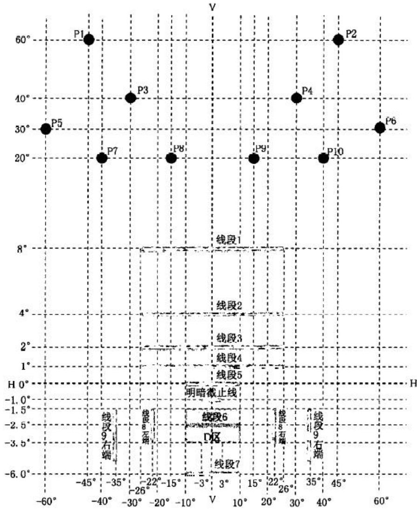  
图 2 F3级前雾灯配光屏幕

5.9.3.2 明暗截止线应符合以下要求：

a） 光束应在照准屏幕上 V-V 线左右两侧超过 5°的宽度范围内产生一对称且大致水平的明暗截止线以进行目视垂直调整；

b） 如无法满足上述要求，则明暗截止线按 6.4.2.3 试验,其质量应符合 D.4.2要求。

5.9.3.3 照准后，F3级前雾灯应符合表 2的配光规定。

表 2 F3级前雾灯配光性能要求
<table><tr><td rowspan=1 colspan=1>线或区域</td><td rowspan=1 colspan=1>垂直位置a+为H-H线上-为H-H线下</td><td rowspan=1 colspan=1>水平位置a-为V-V线左端+为V-V线右端</td><td rowspan=1 colspan=1>发光强度/cd</td><td rowspan=1 colspan=1>适用要求</td></tr><tr><td rowspan=1 colspan=1>点1、2b</td><td rowspan=1 colspan=1>+60°</td><td rowspan=1 colspan=1>±45°</td><td rowspan=5 colspan=1>≤85</td><td rowspan=5 colspan=1>所有点</td></tr><tr><td rowspan=1 colspan=1>点3、4b</td><td rowspan=1 colspan=1>+40°</td><td rowspan=1 colspan=1>±30°</td></tr><tr><td rowspan=1 colspan=1>点5、6b</td><td rowspan=1 colspan=1>+30°</td><td rowspan=1 colspan=1>±60°</td></tr><tr><td rowspan=1 colspan=1>点7、10b</td><td rowspan=1 colspan=1>+20°</td><td rowspan=1 colspan=1>±40°</td></tr><tr><td rowspan=1 colspan=1>点8、9b</td><td rowspan=1 colspan=1>+20°</td><td rowspan=1 colspan=1>±15°</td></tr><tr><td rowspan=1 colspan=1>线段1b</td><td rowspan=1 colspan=1>+8°</td><td rowspan=1 colspan=1>-26到+26°</td><td rowspan=1 colspan=1>≤130</td><td rowspan=1 colspan=1>所有线段</td></tr><tr><td rowspan=1 colspan=1>线段2b</td><td rowspan=1 colspan=1>+4°</td><td rowspan=1 colspan=1>-26到+26°</td><td rowspan=1 colspan=1>≤150</td><td rowspan=1 colspan=1>所有线段</td></tr><tr><td rowspan=1 colspan=1>线段3</td><td rowspan=1 colspan=1>+2°</td><td rowspan=1 colspan=1>-26到+26°</td><td rowspan=1 colspan=1>≤245</td><td rowspan=1 colspan=1>所有线段</td></tr><tr><td rowspan=1 colspan=1>线段4</td><td rowspan=1 colspan=1>+1°</td><td rowspan=1 colspan=1>-26到+26°</td><td rowspan=1 colspan=1>≤360</td><td rowspan=1 colspan=1>所有线段</td></tr><tr><td rowspan=1 colspan=1>线段5</td><td rowspan=1 colspan=1>0°</td><td rowspan=1 colspan=1>-10°到+10°</td><td rowspan=1 colspan=1>≤485</td><td rowspan=1 colspan=1>所有线段</td></tr><tr><td rowspan=1 colspan=1>线段6</td><td rowspan=1 colspan=1>-2.5°</td><td rowspan=1 colspan=1>内5到外10°</td><td rowspan=1 colspan=1>≥2700</td><td rowspan=1 colspan=1>所有线段</td></tr><tr><td rowspan=1 colspan=1>线段7°</td><td rowspan=1 colspan=1>-6.0°</td><td rowspan=1 colspan=1>内5到外10°</td><td rowspan=1 colspan=1>小于线段6最大值的50%</td><td rowspan=1 colspan=1>所有线段</td></tr><tr><td rowspan=1 colspan=1>线段8左端和右端c</td><td rowspan=1 colspan=1>-1.5°到-3.5°</td><td rowspan=1 colspan=1>-22°和+22°</td><td rowspan=1 colspan=1>≥1100</td><td rowspan=1 colspan=1>至少一个点</td></tr><tr><td rowspan=1 colspan=1>线段9左端和右端c</td><td rowspan=1 colspan=1>-1.5°到-4.5°</td><td rowspan=1 colspan=1>-35°和+35°</td><td rowspan=1 colspan=1>≥450</td><td rowspan=1 colspan=1>至少一个点</td></tr><tr><td rowspan=1 colspan=1>D区</td><td rowspan=1 colspan=1>-1.5到-3.5°</td><td rowspan=1 colspan=1>-10°到+10°</td><td rowspan=1 colspan=1>≤12000</td><td rowspan=1 colspan=1>整个区域</td></tr><tr><td rowspan=1 colspan=5>a用垂直极轴的角度网来表示坐标轴。b见5.9.3.7。c见5.9.3.5。</td></tr></table>

5.9.3.4 线段 5以上左右各 10°区域内不应出现影响良好可见度的光强的明显变化。

5.9.3.5 根据制造商或申请人的要求，按 7.1.3.12要求提供两只组成一对的前雾灯可单独测试。此情况下，两灯在表 2中规定的线段 6、7、8、9和 D区域测得的读数的和的一半应符合限值要求。然而，在线段 6处，每个前雾灯都应达到最低配光要求的 50%。

5.9.3.6 图 3的线段 1到线段 5之间区域的光分布应足够均匀。不应在线段 6、7、8、9之间的区域内有影响良好可见度的明显光强变化。

5.9.3.7 根据表 2的配光要求，在包含点 1到点 10和线段 1的区域内，或线段 1和线段 2之间的区域内，可出现不超过 175cd的单个点或条纹，只要单个点的锥形立体角不超过 2°或条纹的宽度不超过 1°。如有多个点或条纹出现,则应最小间隔 10°。

## 5.9.3.8 其他方面应符合以下要求：

a） 对于整流器未和光源整合的气体放电光源前雾灯，在其未经历点灯超过 30min情况下，启动后4 s,其在水平 0°垂直-2°处的发光强度应大于 1080 cd；

b） 对于符合 5.8.2要求的自动变光前雾灯应按 6.4.1.1.2进行系统的符合性检验时，光照强度应在表2 中规定的照度值 60%和 100%范围内：

1） 检测机构应验证系统是否提供自动变光，并达到良好的路面照明且不引起驾驶员或其他道路使用者的不舒适；

2） 配光性能检测应按制造商或申请人的说明进行。

## 6 试验方法

## 6.1 试验室要求

试验暗室、装置及设备，应符合 GB 4599规定。

## 6.2 测量前雾灯配光性能的配光屏幕要求

6.2.1 在距离前雾灯基准中心前 25m处，配光屏幕上照度测量的有效区域，应包含在边长为 65mm的正方形内。点 HV为垂直轴线坐标系的中点，H-H线为通过 HV点的水平轴线。

6.2.2 测量屏幕应为带极轴的球角度坐标测量网络（见图 3）。

6.2.3 测量网格应以 V-V线为对称轴分布。角度网格简化为矩形网格显示。

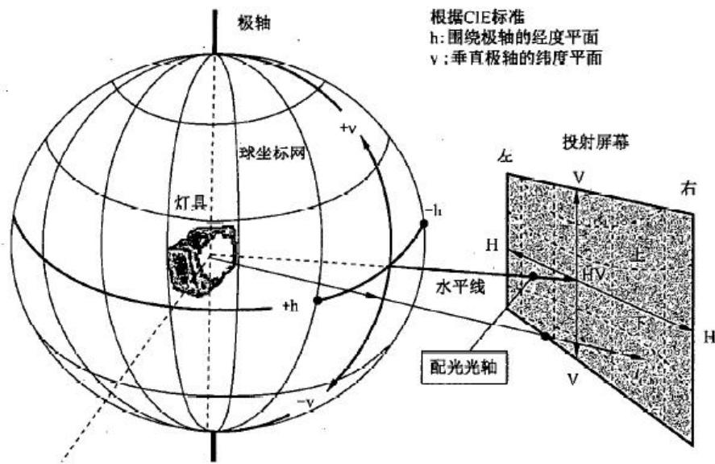  
图 3 带极轴的球角度坐标测量网格

## 6.3 B级前雾灯配光性能的测量

6.3.1 应使用符合 GB15766.1或 ECER37要求的无色标准灯泡，由制造厂规定的类型灯泡可以由制造商或申请人提供。如果至少有一个标准灯泡装配后符合配光性能要求，则认为前雾灯是合格的。

6.3.2 试验电压应符合以下要求：

a） 在测试前雾灯期间,.灯丝灯泡的电源应规范至 GB 15766.1或 ECE R37号法规数据页上 13.2V所获得参考光通量的电压；

b） 如灯丝灯泡不可更换，前雾灯的终端电压应规范到 13.2V。

6.3.3 配光测试前应将上述光源以测量时的电压点亮，使其光性能趋于稳定。

6.3.4 B级前雾灯目视校准用的照准屏幕应置于前雾灯前方 10m或 25m的位置。调整前雾灯，使照准屏幕上的截止线位于 H线下 1.15°的位置。

## 6.4 F3级前雾灯配光性能测量

## 6.4.1 各种光源及其试验电压

## 6.4.1.1 对于使用可更换灯丝灯泡光源

6.4.1.1.1 应至少一套完整的前雾灯,该标准灯泡可以由制造商或申请人提供。对于灯丝灯泡直接使用车身电压的情况:前雾灯测试应使用 GB 15766.1或 R37法规中的无色标准灯丝灯泡。测试电压应使用规范至 GB 15766.1或 R37号法规数据页上 13.2V所获得参考光通量的电压。

6.4.1.1.2 对于使用电光源控制器作为前雾灯系统一部分的灯具来说，该灯具的输入终端的电压应按制造商或申请人的规定。

6.4.1.1.3 对于使用电光源控制器不作为前雾灯系统一部分的灯具来说，制造商或申请人公布的电压应适用于该电光源控制器的输入终端。制造商或申请人应提供该灯具的电光源控制器。

## 6.4.1.2 对于使用气体放电光源的前雾灯

应使用符合 GB 15766.1 或 ECE R99 号法规要求的，并且按照 GB 15766.1 的 G.4 或 ECE R99 号法规附件 4的第 4条要求经过 15个循环老化的标准气体放电光源。

当前雾灯做试验时，对于 12 V的系统，镇流器终端或整流器和光源集成的终端电压应保持 13.2V,或者在制造商或申请人所述的车辆电压（±0.1V）下。

气体放电光源的光通量可能和 GB 15766.1或 ECE R99号法规所述的不同，在这种情况下，发光强度值应被适当的修正。

## 6.4.1.3 对于使用不可更换光源的前雾灯

对所有装有不可替换光源的前雾灯测量，电压应为 6.3V、13.2V或 28.0 V或者根据制造商或申请人描述的车辆电压进行。制造商或申请人应提供特定的电源。测试电压应适用于灯具的输入终端。

## 6.4.1.4 对于使用 LED模块的前雾灯

如果不另作说明，装用 LED 模块的前雾灯的测试电压应为对应的 6.3 V、13.2 V或 28.0V。电光源控制器控制的 LED模块应按制造商或申请人指定输入电压进行测量，或者用取代电光源控制器的操作装置及电源进行测量。相应的输入参数（如占空比、频率、脉冲波形、峰值电压）应在提交的材料中写明。

其中通过测试表 2中的线 3和线 4是否满足要求来判断 LED模块是否符合 5.5.2.1的要求。

## 6.4.2 F3级前雾灯照准方法

6.4.2.1 目视校准用照准屏幕图 3应放置于前雾灯前 10 m或者 25 m的位置。

6.4.2.2 按 D.2规定，前雾灯的明暗截止线应调整至 H线下 1°的位置。

6.4.2.3 在目视照准有问题或明暗截止线位置模糊的情况下，应完成以下试验：

a） 按 D.3 调整，按 D.4 规定对明暗截止线的质量进行确认；

b） 使用 D.5规定的仪器方法进行照准。

6.4.2.4 在规定的配光性能不能满足的情况下，允许明暗截止线在垂直方向上不超过士 0.5°和/或水平方向上不超过±2°的范围内重新照准。

## 6.5 前雾灯色度检验

前雾灯发出的光的色度检验应为制造商或申请人选择的白色或者选择性黄色。选择性黄光可以通过光源本色，或通过改变前雾灯配光镜的颜色，或其他方式来获得。应在 6.3.2或 6.4.1规定的电压下测量前雾灯的色度。

## 7 检验规则

## 7.1 型式检验

## 7.1.1 前雾灯制造商或申请人提供的材料

7.1.1.1 三份详细绘制的图纸，前雾灯型式清晰可辨且应有一个前雾灯的正视图，应详细绘制光学部件的细节，如果有,包括横截面；图纸上要留出认证标志的位置。

如果前照灯上装备有一个可调的反射镜,应该指明前雾灯相对于地面以及车辆纵向对称面的安装位置,如果前雾灯仅能在该位置使用。

## 7.1.1.2 对于塑料配光镜的塑料材料试验应提供：

a） 配光镜共需要 14块：

1） 其中 6块配光镜可以用最小尺寸为 60mm×80mm的 6块材料试样替代，其外表面的曲率半径不小于 300mm，中间有一个可供测量用的尺寸至少为 15mm×15 mm足够平的区域；

2） 每块配光镜或材料试样应是使用批量生产方法制造的；

3） 一只反射镜,按制造厂的说明可将配光镜正确安装上。

b） 有关配光镜和涂层材料的特性说明，若已进行过试验，则附上有关试验报告；

c） 对于超过 2000 lm 的前雾灯光源，应在申请型式检验的技术说明中注明。

## 7.1.2 B级前雾灯的材料

7.1.2.1 一份包括使用的灯丝灯泡类别的技术说明。即使灯丝灯泡是不可更换的，也应是在申请型式批准时有效的 GB 15766.1或 R37号法规及其修正案中所批准的。

7.1.2.2 每个型式的前雾灯应有两个样品，一个安装在车辆左侧，另一个安装在车辆右侧。

## 7.1.3 F3 级前雾灯的材料

7.1.3.1 一份包括使用的光源的类别简单的技术说明，即使光源是不可更换的，也应是在申请型式批准时有效的 GB 15766.1和 R37法规或者 R99法规及它们的修正案中所批准的。

7.1.3.2 如装用 LED模块或者光源发生器，技术说明应写明模块的特定识别码（若有要求）。图纸上应包含详细视图，显示识别码及其标识位置以及制造商或申请人的商标。

7.1.3.3 如有整流器和/或电光源控制器类型和构造,技术说明应包含以下内容：

a） 对于自适应前雾灯,详细描述的可变光强控制；

b） 对于使用电光源控制器不作为前雾灯系统一部分的灯具，应在技术说明中注明电光源控制器的描述（如有）和/或电压及公差。

7.1.3.4 如果前雾灯配备了 LED模块或者一个分布式照明系统（DLS）,技术说明还应包括光源制造商或申请人指派的零件号，一份尺寸图纸和基本的电子及光学数据，一份光源是否符合 C.4.6的 UV辐射要求的说明，一份对应于 5.5.2以及目标光通量的测试报告。

7.1.3.5 如果使用了分布式照明系统（DLS）,也就是说前雾灯的光束由该部件提供。技术说明还应包括光导和对应的光学部件和足以识别光源发生器的信息描述。信息描述应包括光源发生器制造商或申请人指派的零件号，一份尺寸图纸和基本的电子及光学数据，一份对应于 5.5.2的测试报告。

7.1.3.6 如果前雾灯使用气体放电光源应提供：

a） 一个整流器，允许其整体或者部分与前雾灯整合。并且整流器不与光源整合。

b） 如果分布式照明系统（DLS）采用的不可更换光源未被 R99 批准，对于每一个型式应同时递交两套系统，其应包含光源发生器和整流器，如果适用。

7.1.3.7 对于使用 5.4.3的 a）、b）、c）要求的光源，如果其塑料部件无法提供如 UV防护玻璃滤光片遮蔽放电光源的 UV辐射的证明，则应提供：

每种相关材料应递交一样品。样品应和被检测的前雾灯或分布式照明系统（DLS）具有类似的几何尺寸。而且每个材料样品应与递交认证的前雾灯具有相同的外观和表面处理，如果有的话。

7.1.3.8 根据 7.1.3.7和/或 5.5.2认证的前雾灯，其塑料内部光学零件应做抗 UV测试：

内部光学零件的材料，如果有，应递交抗 UV辐射的材料测试报告。

7.1.3.9 每个型式的前雾灯应有两个样品，一个安装在车辆左侧，另一个安装在车辆右侧，或者是配套的一对前雾灯。

7.13.10 如果有，一只电光源控制器。

7.1.3.11 如果有，一个可变光强控制器或者发生器，以提供相同的信号。

7.1.3.12 非对称光型且不可左右混装的 F3级前雾灯，应在灯具上有左右标识。

## 7.1.4 前雾灯的型式试验

7.1.4.1 前雾灯应符合 5.1、5.5、5.7、5.8的规定。

7.1.4.2 按第 6章的规定进行试验，每只样灯应符合 5.2和 5.9的规定，对于 F3级前雾灯还应满足5.6的规定。

7.1.4.3 对于前雾灯的配光稳定性还应满足 5.3的规定。

7.1.4.4 对于使用塑料配光镜的前雾灯，还应符合 5.4规定。

## 7.2 生产一致性检验

7.2.1 对型式检验合格的产品，用从批量产品中随机抽取的样灯来判定其生产的一致性，对于有明显缺陷的不予考虑。

7.2.2 随机抽取的样灯,应符合 5.1、5.5、5.7 和 5.8 的规定。

7.2.3 按第 6章规定进行试验,应满足 5.2和附录 E的规定。

如果配光测试结果不符合要求，应对前雾灯光轴进行左右偏离不超过 0.5°，上下偏离不超过 0.2°的调整，其配光应符合所有的配光规定。

如果配光要求仍不符合，那么截止线允许在垂直方向±0.5°和/或水平方向士 2°范围内再照准。再照准后，应符合所有的配光规定。

在公差范围内，明暗截止线无法通过垂直调光使复现光型达到所需要的位置，那么应采用附录 D的仪器照准的方式且应对一个样品进行截止线质量的考评。

7.2.4 明暗截止线受热变化应符合 A.3.3的规定。

7.2.5 装用无色光源发出黄光的前雾灯，其配光值为要求的 0.84倍。

7.2.6 对于装用塑料配光镜的前雾灯，还应符合 B.3的要求。

## 8 过渡期要求

8.1 自本标准实施之日起，对于新申请型式检验的前雾灯给予 24个月的过渡期。

8.2 自本标准实施之日起，对于新申请型式检验的车型给予 36个月的过渡期。

8.3 自本标准实施之日起，对于已批准认证的前雾灯及整车给予直至停产的过渡期。

8.4 对于不牵涉型式更改的前雾灯按原批准时标准要求给予扩项申请。

8.5 自本标准实施之日起，60 个月后新申请型式检验的前雾灯应符合 F3级前雾灯要求。

# 附录 A

# （规范性附录）

# 前雾灯的配光性能稳定性试验（对前雾灯整灯试验）

## A.1 前雾灯测前准备工作

按照配光的检测要求，就前雾灯整灯而言，D区 $\Gamma _ { \mathrm { E } _ { \mathrm { m a x } } } )$ 点和 HV点对前雾灯使用中配光稳定性进行检测。所谓“前雾灯整灯"是指：车灯以及其周围影响灯泡和灯体部件散热性能的配件。

测试应使用下述方法：

a） 在一干燥不通风的大气环境中，其四周温度在 $2 3 ^ { \circ } \mathrm { C } \pm 5 ^ { \circ } \mathrm { C }$ ，测试样品安装在能代替正确安装在车上的支架上；

b） 对于可更换光源：当使用批产的灯丝灯泡光源时，应至少老练 1h；当使用批产的气体放电光源时，应至少老练 15 h；对于使用批产的 LED模块时，应至少老练 48 h,并且在测试前应冷却至环境温度。应使用制造商或申请人提供的 LED模块。

测试设备应与前灯型式检验中使用的测试设备一致。

测试样品在测试过程中不应从测试设备上取下或者重新调整。并且应使用前雾灯规定等光源类型。

## A.2 配光性能的稳定性试验

## A.2.1 清洁的前雾灯要求

A.2.1.1 前雾灯应按下述规定的方式点亮 12 h。

A.2.1.1.1 对于认证一个前雾灯照明功能，相应的灯丝按规定的时间 1）点亮；

A.2.1.1.2 对于一个以上的照明功能（如带有一个或多个远光和/或一个前雾灯）：应按下述周期点灯直至规定的时间 1）：

a） 前雾灯灯丝点亮 15min；

b） 所有灯丝灯泡点亮 5 min。

如果制造商或申请人申明，同一时间只使用一个照明功能（例如，只有近光点亮或者只有远光点亮，或者只有前雾灯点亮 1），那么试验应按这个条件进行，依次按 A.2.1规定的时间的一半点亮前雾灯再按

A.2.1 规定的时间的一半点亮某一个其他的照明功能。

A.2.1.1.3 对于带有近光和一个或多个照明功能（其中的一个功能是前雾灯）的前雾灯

A.2.1.1.3.1 前雾灯按下面的周期点灯直至规定的时间：

a） 前雾灯灯丝点亮 15min；

b） 所有灯丝灯泡点亮 5 min。

A.2.1.1.3.2 如果制造商或申请人申明同一时间前雾灯只与近光一同使用或者只能使用前雾灯 2)，那么试验应按这个条件进行,依次按 A.2.1规定的时间的一半点亮 3)近光再按 A.2.1规定的时间的一半点前雾灯。按规定的时间的一半点亮近光的同时按 15 min 关闭 5 min 点亮的周期点亮远光。

A.2.1.1.3.3 如果制造商或申请人申明同一时间前雾灯只能与近光或者远光 2）同时点亮，或者只能使用前雾灯 2），那么试验应按这个条件进行,依次按 A.2.1规定的时间的三分之一点亮 2）近光，按 1.1规定的时间的三分之一点亮远光，按 A.2.1 规定的时间的三分之一点亮前雾灯。

## A.2.1.2 试验电压

电压应适用于如下测试样品的输入终端：

a） 对于直接使用车辆电压系统的可更换灯丝灯泡光源:测试应在相应的 6.3 V、13.2V或 28.0 V 下测量，除非制造商或申请人指定测试样品可以使用不同的电压。在这种情况下，测试应采用灯丝灯泡光源可用的最高的电压进行。

b） 对于可更换气体放电光源：对于车辆12V电压系统电光源控制器上的测试电压应为13.2V±0.1V,或者为在型式认证申请中指定的电压。

c） 对于直接使用车辆电压系统的不可更换灯丝灯泡光源：测试安装有不可更换灯丝灯泡光源（灯丝灯泡和/或其他）的灯具，应在制造商或申请人指定的 6.3V、13.2V或 28.0 V或其他根据相应车辆电压系统电压下操作。

d） 对于可更换或不可更换光源，其直接使用车辆电源电压并且由系统全部控制，或者，使用电源和操作装置供电的光源，上述的测试电压应适用于装置的输入终端。测试实验室可以要求制造商或申请人提供电源和操作装置或者提供给光源供电的特定电源。

e） LED 模块应在相应的 6.3V、13.2 V 或 28.0 V 下测量，如果不是,应按其他方法进行。由电光源控制器操作的 LED模块测试电压应由制造商或申请人指定。

f） 当测试样品与信号灯组合混合或者复合的时候，并且操作并非使用相应的标称电压 6 V、12 V、24 V,应调整到根据制造商或申请人公布的能提供正确配光性能的电压。

## A.2.1.3 试验结果

## A.2.1.3.1 目视检验

前雾灯一旦冷却至环境温度，应以干净的湿棉布清洁其配光镜，目视检验配光镜,应无明显变形、扭曲、裂纹或变色。

## A.2.1.3.2 配光检验

应测定以下测量点的配光值：

如果是 B级前雾灯：HV点和 D区的 $\operatorname { I } _ { \operatorname* { m a x } }$ 。

如果是 F3级前雾灯：线 5上的 H=0的点和 D区的 $\operatorname { I } _ { \operatorname* { m a x } }$ 。

由于支架可能受热变形，允许进行照准调节（明暗截止线的垂直位置变化按 A.3的规定）。

考虑到配光检测中的误差因素，如果前雾灯配光性与检测前所测量到的值之间的差异为 10%，则认为是可以的。

## A.2.2 污染的前雾灯

前雾灯按上述 A.2.1规定试验后，应按下述 A.2.2.1规定准备，然后按 A.2.1.1规定点亮 1 h，之后按A.2.1.3 规定检验。

## A.2.2.1 前雾灯的准备

## A.2.2.1.1 试验混合物

## A.2.2.1.1.1 对于玻璃配光镜前雾灯

涂在前雾灯配光镜上的试验混合物组成（质量比）如下：

9份颗粒度介于 $0 \mu \mathrm { m } { \sim } 1 0 0 \mu \mathrm { m }$ 硅沙；

1份颗粒度介于 $0 \mu \mathrm { m } { \sim } 1 0 0 \mu \mathrm { m }$ 植物性炭粉；

0.2 份 $\mathrm { N a C M C ^ { 4 ) } }$

适量的蒸馏水（其电导率小于 $1 \mathrm { m S } / \mathrm { m } )$

试验混合物的有效期不超过 14天。

## A.2.2.1.1.2 对于塑料配光镜前雾灯

—涂在前雾灯配光镜上的试验混合物组成（质量比）如下：

9份颗粒度介于 $0 \mu \mathrm { m } { \sim } 1 0 0 \mu \mathrm { m }$ 硅沙；

1份颗粒度介于 $0 \mu \mathrm { m } { \sim } 1 0 0 \mu \mathrm { m }$ 植物性炭粉；

0.2 份 $\mathrm { N a C M C ^ { 4 } } ^ { \mathrm { { } } }$ ；

13份蒸馏水（电导率小于 $1 \mathrm { m S } / \mathrm { m } )$

2±1份表面活性剂 5）；

—试验混合物的有效期不超过 14天。

## A.2.2.1.2 试验混合物敷涂

试验混合物应均匀地涂在前雾灯整个透光面上，待干燥后重复敷涂，按照描述的条件，在前雾灯照度直至 D区中的 $\mathrm { E } _ { \mathrm { m a x } }$ 值下降至初始值的 15%〜20%。

## A.3 在受热影响下，明暗截止线垂直位置的变化试验

## A.3.1 试验

对于受热影响而产生的明暗截止线垂直偏移量的检测应该在干燥的、环境温度为 $2 3 ^ { \circ } \mathrm { C } \pm 5 ^ { \circ } \mathrm { C }$ 的、空气相对不通风的场所进行。

按 A.2规定试验后的前雾灯，在不从检测夹具上移下或者重新进行调整的情况下，用装配有一个至少经过 1h老炼的、批量生产的前雾灯进行检测（为了实施检测，按照 A.2.1.2的规定调整检测电压值）。在车灯工作 $3 \mathrm { m i n } \ ( \mathrm { \bf r } _ { 3 } )$ 及 $6 0 \ : \mathrm { m i n } \ : \ : \left( \mathrm { r } _ { 6 0 } \right)$ 后，对位于线 VV 左侧 3°以及右侧 3°之间的明暗截止线的位置进行检测。

对于上述明暗截止线位置偏离情况的检测，可以按任何能够给出可接受的精度及重复性结果的方法实施。

## A.3.2 试验结果

A.3.2.1 试验数据以毫弧度（mrad）为单位表示。当前雾灯上所记录的 $\Delta \mathrm { r } _ { 1 } { = } \left| \mathrm { r } _ { 3 } { - } \mathrm { r } _ { 6 0 } \right|$ 的值不超过 2.0 mrad时 $( \Delta \mathrm { r } _ { 1 } { \le } 2 . 0 \ \mathrm { m r a d } )$ ，是可以接受的。

A.3.2.2 然而，如果检测结果超过 2.0 mrad,但没超过 3.0 mrad（2.0 mrad<Δ r1 ≤ 3.0 mrad），则为了确保装在代表整车上安装位置的支架上的前雾灯机械部件的位置稳定性,应该在连续三次进行下面所描述的循环之后，按照 A.3.1 的规定检测第 2个前雾灯：

a) 前雾灯持续工作 1 h(按 A.2.1.2 的描述，调整电压值)。

b) 关闭前雾灯 1h。

A.3.2.3 如果在第一个前雾灯样品上所测得的 $\Delta \mathbf { r } _ { \mathrm { I } }$ 绝对值与在第二个样品灯上所测得的 $\Delta \mathbf { r } _ { \mathrm { I I } }$ 绝对值之和的平均值不超过 2.0mrad，则认为该款前雾灯是可以接受的。

$$
\frac { \Delta r _ { \mathrm { ~ I ~ } } + \Delta r _ { \mathrm { ~ I ~ } } } { 2 } { \leqslant } 2 \ \mathrm { m r a d }
$$

## A.3.3 明暗截止线在竖直位置发生的变化生产一致性检验

A.3.3.1 连续三次完成 A.3.2.2所描述的周期之后，按照 A.3.1所描述的程序检测前雾灯样品。

A.3.3.2 如果被检测前雾灯样品的 $\Delta \mathbf { r }$ 值不超过 3.0 mrad，则认为该前雾灯合格。如果被检测前雾灯样品的Δr 值超过 3.0 mrad,但不大于 4.0mrad，则应该选出第二个样品进行检测，直至两个样品检测结果的绝对平均值不超过 3.0mrad。

## 附录 B

## （规范性附录）

## 塑料配光镜前雾灯的要求——配光镜或材料试样和整灯试验

## B.1 一般规定

B.1.1 按 7.3.1.2 规定提供的试样，应满足下列 B.2.1〜B.2.5 和 B.2.7 规定。

B.1.2 按 7.3.2（或者 7.3.3如果适用）规定提供的两只样灯和塑料配光镜应满足下列 B.2.6规定。

B.1.3 装配于反射镜（如果有）上的塑料材料配光镜样本或者材料样本,应按表 H.1顺序进行试验。

若灯具制造商或申请人可以证明已通过下列 B.2.1\~B.2.5和 B.2.7规定的试验，或者通过了其他标准规定的等同的测试;则只需按表 C.2的规定试验。

## B.2 试验

## B.2.1 耐温试验

B.2.1.1 试验按下列次序，三件新的配光镜试样应进行 5个循环的温度和湿度（RH=相对湿度）变化试验：

40°C±2°C，RH85%〜95%：3 h；

23°C±5°C，RH60%〜75%：1 h；

-30°C±2°C：15 h；

23°C±5°C，RH60%〜75%：1 h；

80°C±2°C ：3 h；

23°C±5°C，RH60%〜75%：1 h；

在上述试验循环开始前，试样应在 $2 3 ^ { \circ } \mathrm { C } \pm 5 ^ { \circ } \mathrm { C }$ ，RH60%〜75%的环境中至少存放 4h。

注： $2 3 ^ { \circ } \mathrm { C } \pm 5 ^ { \circ } \mathrm { C }$ ，1h；包括了为避免从一种温度转变到另一种温度的热冲击效应所需要的过渡时间。

## B.2.1.2 配光测量

B.2.1.2.1 方法

在对样品进行试验的前后，均应该检测配光。按 5.9.3和 5.9.4的条件检测下述测量点：

B级前雾灯：

a） HV点；和

b） D 区的 H =0，V=2°D 点。

F3级前雾灯：

a） VV线与线 6的交点；和

b） VV线与线 4的交点。

## B.2.1.2.2 测量结果

试验前后每个样品的配光值的变化量不得超过 10%，其中包括配光测量程序的误差。

## B.2.2 耐气候及化学试剂

## B.2.2.1 耐气候试验

三件新的配光镜或其材料试样，应进行日光辐照试验。光源的光谱能量分布相当于 5500 K〜6000 K的黑体。为尽可能减少波长小于 295 nm和大于 2500 nm的辐射影响，光源与试样之间应放置相应的滤光片。试样的辐射照度为 1200 W/m2±200 W/m2，试验期间接收到的辐射能量为 4500 MJ/m2±200 MJ/m2。在试验箱内，与试样处在同一水平位置上的黑板温度为 $5 0 ^ { \circ } \mathrm { C } { \pm } 5 ^ { \circ } \mathrm { C }$ 。试样以 1 r/min〜5 r/min 的速度环绕光源转动。并以下述循环方式喷洒电导率小于 1mS/m $( 2 3 ^ { \circ } \mathrm { C } \pm 5 ^ { \circ } \mathrm { C }$ 时）的蒸储水，即 5min喷洒；25min干燥，直至试验结束。

## B.2.2.2 耐化学试剂试验

按 B.2.2.1所描述的试验结束后和按 B.2.2.3.1的描述进行检测之后，按 B.2.2.2.2的要求，三件试样的外表面应使用 B.2.2.2.1的试验混合物进行试验。

## B.2.2.2.1 试验混合物

试验混合液的体积百分比组成如下：

61.5%庚烷、12.5%甲苯、7.5%四氯乙烷 42.5%三氯乙烯和 6%二甲苯（按照容积计算）。

## B.2.2.2.2 试验混合物的涂覆

将一块棉布（按 ISO 105）浸入 A.2.2.2.1所描述的混合物中直至饱合，在10 s内将其置于检测样品外表面上 10 min,以 $5 0 \mathrm { N } / \mathrm { c m } ^ { 2 }$ 加压；相应的，对于 $1 4 \mathrm { m m } \times 1 4 \mathrm { m m }$ 的检测表面,施压为 100N。

在 10min期间，应该再次浸泡棉布，以使液体与混合物的成分充分融合。

涂覆期间，可以适当地调整压力值，以防样品破裂。

## B.2.2.2.3 清洁

在施加试验混合物结束时，将样品在干燥的通风环境中进行烘干，随后，在 $2 3 ^ { \circ } \mathrm { C } \pm 5 ^ { \circ } \mathrm { C }$ 的温度下，用B.2.3所描述的方法进行清洁（去垢剂）。

在将样品用在 $2 3 ^ { \circ } \mathrm { C } \pm 5 ^ { \circ } \mathrm { C }$ 的温度下的杂质含量不超过0.2%蒸馏水仔细冲洗后，用一块软棉布进行擦拭。

## B.2.2.3 试验结果

B.2.2.3.1 在光源辐照试验试验后，试样外表面应无裂纹、擦伤、屑片和变形。其透过率变化 $\Delta \mathbf { t } = \left( \mathbf { T } _ { 2 } \mathbf { - } \mathbf { T } _ { 3 } \right)$ $/ \mathrm { T } _ { 2 }$ 的平均值 $\Delta \mathrm { t } _ { \mathrm { m } } ,$ ，当按 GB4599中附录 D规定的方法，对三件试样进行测量时，应不大于 0.020（即： $\Delta \mathbf { t } _ { \mathrm { m } }$ ${ \leqslant } 0 . 0 2 0 )$

B.2.2.3.2 耐化学试剂试验后，试样应无任何会引起光束漫射变化的污痕,其漫射光透过率变化Δd=$( \mathrm { T } _ { 5 } \mathrm { - } \mathrm { T } _ { 4 } ) / \mathrm { T } _ { 2 }$ 的平均值 $\Delta \mathbf { d } _ { \mathrm { m } }$ ，当按 GB4599中附录 D规定的方法，对三件试样进行测量时，应不大于 0.020（即： $\Delta \mathrm { d } _ { \mathrm { m } } { \leqslant } 0 . 0 2 0 $ ）。

## B.2.3 耐洗涤剂和燃油剂试验

## B.2.3.1 耐洗涤剂

三件配光镜或其材料试样的外表面应加热到 $5 0 ^ { \circ } \mathrm { C } { \pm } 5 ^ { \circ } \mathrm { C } ,$ 然后，浸入到 $2 3 ^ { \circ } \mathrm { C } \pm 5 ^ { \circ } \mathrm { C }$ 的洗涤剂混合液中5min。  
洗涤剂混合液由 99份杂质含量不超过 0.02%的蒸馏水和 1份烷基去垢剂组成。

试验后，在 $5 0 ^ { \circ } \mathrm { C } { \pm } 5 ^ { \circ } \mathrm { C }$ 下干燥试样,并用湿棉布擦净试样表面。

## B.2.3.2 耐燃油试验

然后，三件试样的外表面，用浸有体积分数为 $7 0 \text{‰}$ 庚烷和 30%甲苯的燃油试剂的棉布轻擦 1 min。之后，应在室外空气中干燥。

## B.2.3.3 试验结果

在依次进行了上述两项试验后，三件试样透过率变化 $\Delta \mathrm { t } = \mathrm { ~ ( } \mathrm { T } _ { 2 ^ { - } } \mathrm { T } _ { 3 } \mathrm { ) ~ } / \mathrm { T } _ { 2 }$ 的平均值 $\Delta \mathrm { t } _ { \mathrm { m } }$ ，当按 GB 4599 中附录 D规定的方法测量时，应不大于 0.010（即： $\Delta \mathrm { t } _ { \mathrm { m } } { \leqslant } 0 . 0 1 0 $

## B.2.4 机械磨损试验

## B.2.4.1 试验

三件新的配光镜试样，应按 GB 4599 中附录 E 规定的方法进行机械磨损试验。

## B.2.4.2 试验结果

试验后，试样透过率变化 $\Delta \mathrm { t } { } = \mathrm { \Omega } ( \mathrm { T } _ { 2 } { \mathrm { - } } \mathrm { T } _ { 3 } ) \mathrm { \Omega } / \mathrm { T } _ { 2 }$ ，漫射透过率变化 $\Delta { \mathsf { d } } { } = \left( \mathsf { T }  { } _ { 5 } { } - \mathsf { T } { } _ { 4 } \right) / \mathsf { T } { } _ { 2 }$ ，当按附录 C规定的方法，对三件试样进行测量时，其平均值应为： $\Delta \mathrm { t } _ { \mathrm { m } } { \leqslant } 0 . 1 0 0 ; \Delta \mathrm { d } _ { \mathrm { m } } { \leqslant } 0 . 0 5 0$

## B.2.5 配光镜涂层附着力试验

## B.2.5.1 样品准备

在配光镜涂层 20mm×20mm表面区域上，用刀片或尖针刻划成约 2mm×2mm的方格子，其所用之力应划透涂层。

## B.2.5.2 试验说明

使用宽度不小于 25mm的粘胶带,按压在上述网格区域上至少 5min。在按 GB4599中附录 F规定的标准条件下测量粘胶带的附着力应为 2N/cm（粘胶带宽度）±20%。

然后，在粘胶带一端,垂直于表面方向上施加与附着力平衡的力，以 1.5m/s±0.2m/s的均匀速度撕去粘胶带。

## B.2.5.3 试验结果

试验后，网格区域应无可见的损伤。格子交点和划痕损伤应不大于网格面积的 15%。

## B.2.6 塑料配光镜的整灯试验

## B.2.6.1 机械磨损试验

1号样灯的应按 B.2.4.1规定进行配光镜机械磨损试验。

试验后，B级前雾灯的B区的最大照度值，以及F3级前雾灯的线 2和 5应不超过规定的最大值的30%。

## B.2.6.2 配光镜涂层附着力试验

2号样灯应按上述 B.2.5规定进行试验。

## B.2.7 耐气体放电光源辐照试验

B.2.7.1对需按5.4.2要求进行抗UV辐照试验的前雾灯,应对其内的所有透光的塑料材料零件进行耐UV辐照试验。

B.2.7.1.1 将扁平的前雾灯塑料透光部件样品暴露在气体放电光源下。样品与光源的角度及距离等参数应与前雾灯一致。

B.2.7.1.2 1500小时的连续暴露后，使用新的标准光源或光源模块,前雾灯透过光的色度应符合规定，且样品表面应无开裂，裂缝，脱落或变形。

## B.3 生产一致性检验

B.3.1 就配光镜材料而言,在下述情况下，其生产一致性符合要求：

B.3.1.1 按 B.2.2.2、B.2.3.1和 B.2.3.2的规定，进行耐化学试剂、耐洗涤剂和耐燃油试验后，试样外表面应无肉眼可见的裂纹、屑片或变形。

B.3.1.2 按 B.2.6.1.1规定进行机械磨损试验后，B.2.6.1.2规定的测量值应符合生产一致性检验规定限值。

B.3.2 若试验结果不满足要求,则应对随机抽取的另一只样灯再次试验。

## 附录 C

## （规范性附录）

## 装用 LED模块或光源发生器的有关规定

## C.1 一般规定

C.1.1 当与供电的电光源控制器同时试验时,每一个 LED模块或光源发生器样品都应符合要求。

C.1.2 LED模块或光源发生器应在正常使用条件下能保持正常工作。而且在设计或生产过程中不应出错。

C.1.3 LED模块或光源发生器应防抖动。

C.1.4 可更换的 LED模块应满足以下要求：

a） 移除和更换模块后,应符合前雾灯的配光规定。

b） 同一灯体内，不同类型的 LED模块不可混装。

C.1.5 如果是 LED模块，应满足以下要求：

a） 光辐照及屏蔽元件的几何位置和尺寸应在递交的数据单上注明。

b） 测量应在电光源控制器测试电压下进行老化后，采用光学方法,透过透明封套进行。

c） 配光挡板的位置、尺寸和透光性，如果有,应在提交的数据单上注明。

## C.2 制造

C.2.1 光源的透明封套（如:灯泡）应无影响其效率和光学性能的标注或斑点。

C.2.2 如果是 LED模块或光源发生器，应满足以下要求：

a） LED模块上的 LED应被装配在核实的固定元件上。

b） 固定元件应有足够的强度且能与光源和 LED模块稳固相连。

c） 光源发生器中的光源应配有合适的固定元件。

d） 固定元件应有足够的强度且能与光源和光源发生器稳固相连。

## C.3 试验条件

## C.3.1 适用及放宽

C.3.1.1 所有的样品应按 C.4进行试验。

C.3.1.2 光源类型应按相关的定义,尤其是在可见波段。非可见波段不适用。

C.3.1.3 LED模块或光源发生器的工作条件

C.3.1.3.1 所有样品应按 6.4.1.4 的条件进行试验。

C.3.1.3.2 除特别说明外，LED模块或者光源发生器应装于制造商或申请人递交的前雾灯内进行试验。

## C.3.1.4 环境温度

测量电性能和配光性能时，前雾灯应在干燥且不通风，温度为 $2 3 ^ { \circ } \mathrm { C } \pm 5 ^ { \circ } \mathrm { C }$ 的环境下工作。

C.3.1.5 对于光源发生器

C.3.1.5.1 电源供给要求

启动和实验运行电源的供应足够以确保快速上升的高电流脉冲。

## C.3.1.5.2 点灯位置要求

点灯位置应按制造商或申请人的要求。老化和测试的位置应相同。如果灯具偶然出现了错误的工作方向，再次测量前应对其进行重复的老化。老化和测试过程中，不应在制造商或申请人要求的区域内出现用电物体。而且应避免杂散电场。

C.3.2 老化

C.3.2.1 LED模块或光源发生器应进行老化。

C.3.2.2 LED模块或光源发生器应在电光源控制器提供的电压下进行老化试验，之后实施下述的实验。

C.3.2.3 LED模块按制造商或申请人申请，LED模块应连续工作 15h且冷却至室温后再进行相关实验。

C.3.2.4 灯丝灯泡应先在试验电压下经历大约 1 h的老化。对于双丝灯泡，每一个灯丝都应单独进行老化。

C.3.2.5 气体放电灯泡除了启动试验外，所有的实验都应采用至少经历了 15循环的老化的光源。每一个循环周期为：45 min 打开,15 min 关闭，5 min 打开,10 min 关闭。

## C.4 特定试验

C.4.1 符合 GB 15766.1 和 R37 法规的灯丝灯泡，符合 GB 15766.1 和 ECE R99 号法规的气体放电光源和 LED 模块不必进行下述 C.4.3.1 和 C.4.3.2 的实验。

C.4.2 对于气体放电光源，开始试验应采用没有经历过老化且在试验前 24 h内未经使用的光源。光源应直接启动且保持点亮状态。

C.4.3 预热

C.4.3.1 灯丝灯泡免做此项试验。

C.4.3.2 对于气体放电光源，预热试验应采用在试验前 1 h内没有使用过的光源。前雾灯应至少在线 6上的点 0°,2.5°D达到以下数值：

1 s后：25%的目标光通量；

4 s后：80%的目标光通量。

C.4.4 热的再冲击

C.4.4.1 灯丝灯泡免做此项试验。

C.4.4.2 对于气体放电光源,在工作电压下，由电光源控制器启动光源且至少工作 15min。然后切断电光源控制器的电源 10s,然后再次打开电源。光源控制器应在关闭 10s后直接启动。在 Is后，光源应至少发出 80%的目标光通量。

C.4.5 显色性

C.4.5.1 红色光含量

按 6.4 进行测量,LED 模块或光源发生器的最小红色光含量应符合：

$$
\begin{array} { l } { { \displaystyle { k _ { \mathrm { e d } } = \frac { \displaystyle \sum _ { \lambda = 6 1 0 ~ n m } ^ { 7 8 0 ~ n 0 } E _ { \lambda } ( \lambda ) V ( \lambda ) \mathrm { d } \lambda } } \ g _ { \lambda } = 0 . 0 5 } } \\ { { \displaystyle \operatorname* { f } _ { \lambda = 3 8 0 ~ n m } E _ { \lambda } ( \lambda ) V ( \lambda ) \mathrm { d } \lambda } } \end{array}\tag{…(C.1}
$$

式中：

$\mathrm { E } _ { \mathrm { e } } ( \lambda )$ 光谱辉度分布，单位为瓦(W)；

V(λ)— 波谱发光效率，单位为 1；

λ 波长，单位为纳米(nm)；

这个数值的差值计算应采用 1个 nm的精度。

C.4.6 UV-辐照

LED模块或光源发生器的 UV-辐照应符合：

$$
k _ { \mathrm { U V } } = \frac { \displaystyle { \sum _ { \lambda = 2 5 0 \operatorname* { m i n } _ { \lambda \in \mathcal { X } \setminus \mathcal { X } \setminus \mathcal { X } \setminus \mathcal { X } } } ^ { 4 0 0 \operatorname* { m i n } } } E _ { \star } ( \lambda ) S ( \lambda ) \mathrm { d } \lambda }  \displaystyle { k _ { \mathrm { m } } \sum _ { \lambda = 3 8 0 \operatorname* { m i n } _ { \lambda \in \mathcal { X } \setminus \mathcal { X } \setminus \mathcal { X } \setminus \mathcal { X } \setminus \mathcal { X } \setminus \mathcal { X } } } ^ { 5 0 0 \operatorname* { m i n } } } \leqslant 1 0 ^ { - 5 } ( \mathrm { W / l m } ) \quad . . . . . . . . . . . . . . . . . . . . . . . . . . . . . . . . . . . . . . . . . . . . . . . . . . . . . . . . .
$$

式中：

S(λ) ——光谱加权值,单位为 1；

$k _ { m } = 6 8 3 \mathrm { ~ l m } / \mathrm { ~ W ~ }$ 是辐照光效的最大值。

这个数值的差值计算应采用 1nm的精度。UV辐照的加权值参考表 C.1,数值按“IRPA/INIRC关于紫外线辐照暴露的指示波长(单位 nm)的选择的是有代表性的:其他的值应为插值。

表 C.1
<table><tr><td rowspan=1 colspan=1>Nnm</td><td rowspan=1 colspan=1>S(2）</td><td rowspan=1 colspan=1>2nm</td><td rowspan=1 colspan=1>S(2）</td><td rowspan=1 colspan=1>Nnm</td><td rowspan=1 colspan=1>S(2)</td></tr><tr><td rowspan=1 colspan=1>250</td><td rowspan=1 colspan=1>0.430</td><td rowspan=1 colspan=1>305</td><td rowspan=1 colspan=1>0.060</td><td rowspan=1 colspan=1>360</td><td rowspan=1 colspan=1>0.00013</td></tr><tr><td rowspan=1 colspan=1>255</td><td rowspan=1 colspan=1>0.520</td><td rowspan=1 colspan=1>310</td><td rowspan=1 colspan=1>0.015</td><td rowspan=1 colspan=1>365</td><td rowspan=1 colspan=1>0.00011</td></tr><tr><td rowspan=1 colspan=1>260</td><td rowspan=1 colspan=1>0.650</td><td rowspan=1 colspan=1>315</td><td rowspan=1 colspan=1>0.003</td><td rowspan=1 colspan=1>370</td><td rowspan=1 colspan=1>0.00009</td></tr><tr><td rowspan=1 colspan=1>265</td><td rowspan=1 colspan=1>0.810</td><td rowspan=1 colspan=1>320</td><td rowspan=1 colspan=1>0.001</td><td rowspan=1 colspan=1>375</td><td rowspan=1 colspan=1>0.000077</td></tr><tr><td rowspan=1 colspan=1>270</td><td rowspan=1 colspan=1>1.000</td><td rowspan=1 colspan=1>325</td><td rowspan=1 colspan=1>0.00050</td><td rowspan=1 colspan=1>380</td><td rowspan=1 colspan=1>0.000064</td></tr><tr><td rowspan=1 colspan=1>275</td><td rowspan=1 colspan=1>0.960</td><td rowspan=1 colspan=1>330</td><td rowspan=1 colspan=1>0.00041</td><td rowspan=1 colspan=1>385</td><td rowspan=1 colspan=1>0.000053</td></tr><tr><td rowspan=1 colspan=1>280</td><td rowspan=1 colspan=1>0.880</td><td rowspan=1 colspan=1>335</td><td rowspan=1 colspan=1>0.00034</td><td rowspan=1 colspan=1>390</td><td rowspan=1 colspan=1>0.000044</td></tr><tr><td rowspan=1 colspan=1>285</td><td rowspan=1 colspan=1>0.770</td><td rowspan=1 colspan=1>340</td><td rowspan=1 colspan=1>0.00028</td><td rowspan=1 colspan=1>395</td><td rowspan=1 colspan=1>0.000036</td></tr><tr><td rowspan=1 colspan=1>290</td><td rowspan=1 colspan=1>0.640</td><td rowspan=1 colspan=1>345</td><td rowspan=1 colspan=1>0.00024</td><td rowspan=1 colspan=1>400</td><td rowspan=1 colspan=1>0.000030</td></tr><tr><td rowspan=1 colspan=1>295</td><td rowspan=1 colspan=1>0.540</td><td rowspan=1 colspan=1>350</td><td rowspan=1 colspan=1>0.00020</td><td rowspan=1 colspan=1></td><td rowspan=1 colspan=1></td></tr><tr><td rowspan=1 colspan=1>300</td><td rowspan=1 colspan=1>0.300</td><td rowspan=1 colspan=1>355</td><td rowspan=1 colspan=1>0.00016</td><td rowspan=1 colspan=1></td><td rowspan=1 colspan=1></td></tr></table>

C.4.7 温度稳定性

C.4.7.1 发光强度

C.4.7.1.1 灯丝灯泡和气体放电光源免做该试验。

C.4.7.1.2 装置在室温下工作 1 min后测量配光。测试点为水平 0°，垂直向下 2.5°。

C.4.7.1.3 灯具应继续工作直至达到稳定状态。稳定状态的定义为测试点的配光值的改变量在 15min内小于 3%的那个时间点。达到稳定后，根据特定装置的要求，对整灯做配光照准。特定装置的每个测试点都应进行配光检测。

C.4.7.1.4 一旦稳定后，计算 C.4.7.1.2 和 C.4.7.1.3 的测试点的配光值的比值。

C.4.7.1.5 剩下的测试点适用 C.4.7.1.4的计算比值，得到新的关于工作 1 min后的包括所有测试点的整份配光表格。

C.4.7.1.6 1 min后和稳定后的照度值应符合最小值和最大值的规定。

## C.4.7.2 色度

发出的光的色度，应在工作后 1min和工作后 30min进行测量，两种情况下都应在规定的颜色边界之内。

## 附录 D

## （规范性附录）

F3级前雾灯明暗截止线锐度及其定义以及使用明暗截止线进行照准的程序

## D.1 总则

前雾灯的光强分布应包括一明暗截止线,使其能正确进行照准且进行配光性能测量和在车上进行照准。截止线的特性应符合 D.2〜D.4的规定。

## D.2 截止线的形状

为了对前雾灯的光束进行目视调整，明暗截止线应提供一延伸至 V-V线左右 4°的水平线用于前雾灯的垂直调整（如图 D.1）。

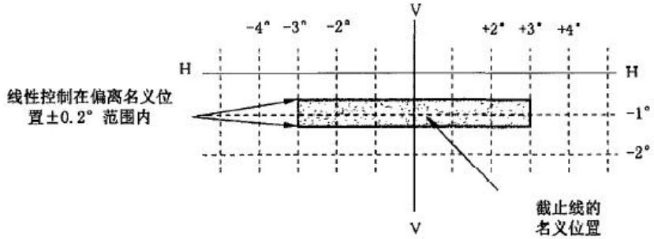  
图 D.1 明暗截止线的位置和形状

## D.3 前雾灯的调整

## D.3.1 水平调整

应使明暗截止线的位置大致处于投射光型相对 V-V线对称的位置。当前雾灯设计为成对使用或者非对称光型时，明暗截止线的水平照准位置应按制造商或申请人的说明调整，或是相对 V-V线对称。

## D.3.2 垂直调整

D.3.2.1 按 D.3.1对前雾灯进行了水平调整后，应按如下方式进行垂直调整：明暗截止线从较低位置向上移动直到其位于 H-H线下 1°的水平线上，如其水平部分不平而是弯曲或倾斜的，明暗截止线在 V-V线左右 3°之间的部分,不应超出明暗截止线名义位置上下 0.2°的水平线所构成的垂直范围。（见图 D.1）

D.3.2.2 如 3 次尝试调整明暗截止线的位置相差超过 0.2°,则认为明暗截止线的水平部分不能提供足够的线性或锐度进行目视调整。在这种情况下，应使用仪器测量明暗截止线的质量是否符合 D.4要求。

## D.4 明暗截止线质量和检测要求

## D.4.1 明暗截止线检测要求

检测应对明暗截止线的水平部分进行垂直扫描，步进角度值不超过 0.05°。

测量距离 10 m,光度计探头直径大约 10mm；或

测量距离 25 m,光度计探头直径大约 30mm。

沿 V-V线左右 2.5°的垂直线对明暗截止线进行穿越性扫描。如此测量时，截止线的质量应符合 D.4.2要求。

如果在 10m或者 25 m中有一处测量值符合 D.4.2的规定，那么认为该截止线的质量是可以接受的。

## D.4.2 截止线的质量要求

## D.4.2.1 明暗截止线的数量

可见的截止线不可超过 1条。

## D.4.2.2 明暗截止线的锐度

沿 V-V线左右 2.5°的垂直线对明暗截止线的平直部分进行扫描，明暗截止线的锐度 G测量值最大不应小于 0.08。其中： $\mathbf { \sigma } _ { : G } = ( \lg E V - \lg E _ { ( \mathrm { v + \varnothing , 1 ^ { \circ } ) } } )$ 。

## D.4.2.3 明暗截止线的线性

明暗截止线用于提供垂直照准的部分在 V-V线左右 2.5°内应是水平的。按照 D.3.2.1,如在 V-V 线左右2.5°处的拐点 $( \lg E V - \lg E _ { ( \mathrm { v } + 0 . 1 ^ { \circ } ) } )$ 的垂直位置的偏差不超过士 0.20°,则符合该要求。

## D.5 仪器垂直照准

如明暗截止线符合 D.4质量要求,则可用仪器进行光束的垂直调整。光强拐点 $\left[ { \mathrm { d } } _ { 2 } ( \log { \mathrm { E } } ) / { \mathrm { d V } } ^ { 2 } { = } 0 \right]$ 应位于V-V线上且在 H-H线下方。为明暗截止线的测量和调整而进行的移动应从其名义位置(见图 D.1)下方向上移动。

## 附录 E

## （规范性附录）

## 批产一致性控制程序的公差要求

## E.1 B 级前雾灯

任何随机抽样且装备一只标准灯丝灯泡的前雾灯在进行配光性能检测时，任何测量值不可偏离规定的值的 20%以上。

## E.2 F3 级前雾灯

任何随机抽样的前雾灯在按 6.4进行配光性能检测时，任何光强的测量值应满足表 E.1的要求。

表 E.1 一致性配光要求
<table><tr><td rowspan=2 colspan=1>线或区域</td><td rowspan=2 colspan=1>垂直位置aH-H线以上+H-H线以下-</td><td rowspan=2 colspan=1>水平位置aV-V线左侧：-V-V线右侧：+</td><td rowspan=1 colspan=1>照度值/cd</td><td rowspan=2 colspan=1>遵循要求</td></tr><tr><td rowspan=1 colspan=1>相当于20%偏差</td></tr><tr><td rowspan=1 colspan=1>点1、2b</td><td rowspan=1 colspan=1>+60°</td><td rowspan=1 colspan=1>±45°</td><td rowspan=1 colspan=1>≤115</td><td rowspan=5 colspan=1>所有点</td></tr><tr><td rowspan=1 colspan=1>点3、4b</td><td rowspan=1 colspan=1>+40°</td><td rowspan=1 colspan=1>±30°</td><td rowspan=4 colspan=1></td></tr><tr><td rowspan=1 colspan=1>点5、6b</td><td rowspan=1 colspan=1>+30°</td><td rowspan=1 colspan=1>±60°</td></tr><tr><td rowspan=1 colspan=1>点7、10b</td><td rowspan=1 colspan=1>+20°</td><td rowspan=1 colspan=1>±40°</td></tr><tr><td rowspan=1 colspan=1>点8、9b</td><td rowspan=1 colspan=1>+20°</td><td rowspan=1 colspan=1>±15°</td></tr><tr><td rowspan=1 colspan=1>线1b</td><td rowspan=1 colspan=1>+8°</td><td rowspan=1 colspan=1>-26到+26°</td><td rowspan=1 colspan=1>160 max</td><td rowspan=1 colspan=1>整条线上</td></tr><tr><td rowspan=1 colspan=1>线2</td><td rowspan=1 colspan=1>+4°</td><td rowspan=1 colspan=1>-26°到+26°</td><td rowspan=1 colspan=1>180 max</td><td rowspan=1 colspan=1>整条线上</td></tr><tr><td rowspan=1 colspan=1>线3</td><td rowspan=1 colspan=1>+2°</td><td rowspan=1 colspan=1>-26到+26°</td><td rowspan=1 colspan=1>295 max</td><td rowspan=1 colspan=1>整条线上</td></tr><tr><td rowspan=1 colspan=1>线4</td><td rowspan=1 colspan=1>+1°</td><td rowspan=1 colspan=1>-26到+26°</td><td rowspan=1 colspan=1>435 max</td><td rowspan=1 colspan=1>整条线上</td></tr><tr><td rowspan=1 colspan=1>线5</td><td rowspan=1 colspan=1>0°</td><td rowspan=1 colspan=1>-10°到+10°</td><td rowspan=1 colspan=1>585 max</td><td rowspan=1 colspan=1>整条线上</td></tr><tr><td rowspan=1 colspan=1>线6</td><td rowspan=1 colspan=1>-2.5°</td><td rowspan=1 colspan=1>内5到外10</td><td rowspan=1 colspan=1>2160 min</td><td rowspan=1 colspan=1>整条线上</td></tr><tr><td rowspan=1 colspan=1>线8L和R</td><td rowspan=1 colspan=1>-1.5到-3.5°</td><td rowspan=1 colspan=1>-22°和+22°</td><td rowspan=1 colspan=1>880 min</td><td rowspan=1 colspan=1>一个或多个点</td></tr><tr><td rowspan=1 colspan=1>线9L和R</td><td rowspan=1 colspan=1>-1.5到-4.5°</td><td rowspan=1 colspan=1>-35°和+35°</td><td rowspan=1 colspan=1>360 min</td><td rowspan=1 colspan=1>一个或多个点</td></tr><tr><td rowspan=1 colspan=1>区域D</td><td rowspan=1 colspan=1>-1.5到-3.5°</td><td rowspan=1 colspan=1>-10°到+10°</td><td rowspan=1 colspan=1>14400 max</td><td rowspan=1 colspan=1>整个区域</td></tr><tr><td rowspan=1 colspan=5>a用垂直极轴的角度网来表示坐标轴。b见5.9.3.7。见 5.9.3.5。</td></tr></table>

# 附录 F

# （规范性附录）配光稳定性的点灯方式示例

示例

P：近光灯；

D：远光灯（D1+D2表示两个远光）；

F：前雾灯。

所有下述的组合前照灯和前雾灯和附加的标识标注示例都不是最完整无疑的。

：指 15 min 关闭和 5 min点亮循环方式。

下述前照灯和前雾灯组合,只是作为一种示例。

1. P 或 D 或 F（HC 或 HR 或 B 或 F3）

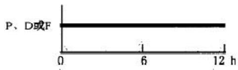

2. P+F（HC、B 或 F3）

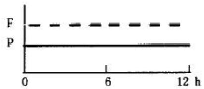

3. P+F（HC、B 或 F3/）或 HC/B 或 F3

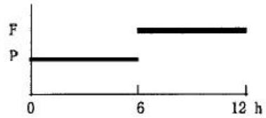

4. D+F（HR B 或 F3）或 D1+D2+F（HR B 或 F3）

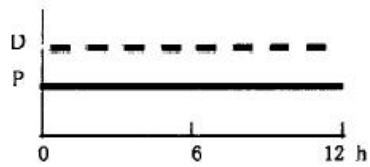

5. D+F（HR、B 或 F3/）或 D1+D2+F（HR、B 或 F3/）

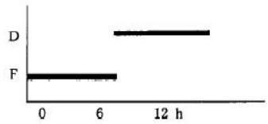

6. $\mathrm { P + D + F ( H C R }$ 、B 或 F3)或 $\mathrm { P + D _ { 1 } + D _ { 2 } + F ( H C R }$ 、HR、B 或 F3)

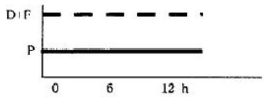

7. $\mathrm { P + D / + F ( H C / R }$ 、B 或 F3)或 $\mathrm { P + D } _ { 1 } \mathrm { + D } _ { 2 } \mathrm { + F }$ (HC/R HR B 或 F3)

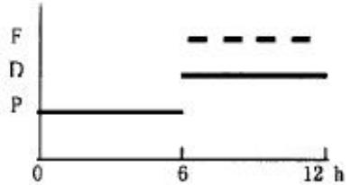

8. P+D+F(HCR B 或 F3)或 $\mathrm { P + D } _ { 1 } { + } \mathrm { D } _ { 2 } .$ +F(HCR HR B 或 F3/)

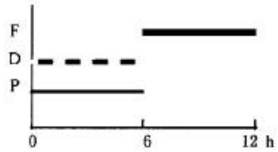

9. P+D+F(HC/R B 或 F3/)或 $\mathrm { P + D _ { 1 } + D _ { 2 } + F ( H C / R \ H R \ B }$ 或 F3/)

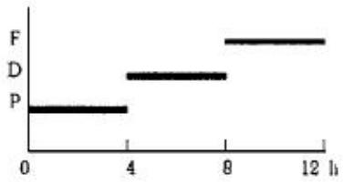

附录 G

（规范性附录）

基准中心

基准中心见图 G.1。

图中圆形直径 a最小尺寸为 2mm。

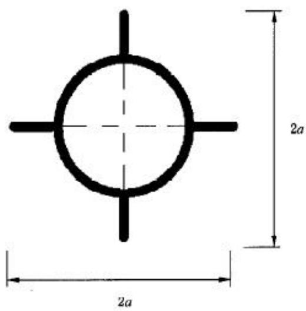  
G.1 基准中心图

这个可选基准中心标识应标注于配光镜与前雾灯轴线相交的位置。

上述图纸标示基准中心投影在与通过圆心的配光镜大致平行的平面上。本标识的直线段可以是实线或者点线。

## 附录 H

## (规范性附录)

试验顺序

按 7.3.1.4规定提供的塑料配光镜或材料试样试验见表 H.1。

表 H.1
<table><tr><td rowspan=2 colspan=1>样品试验</td><td rowspan=1 colspan=6>配光镜或材料试样</td><td rowspan=1 colspan=8>配光镜</td></tr><tr><td rowspan=1 colspan=1>1</td><td rowspan=1 colspan=1>2</td><td rowspan=1 colspan=1>3</td><td rowspan=1 colspan=1>4</td><td rowspan=1 colspan=1>5</td><td rowspan=1 colspan=1>6</td><td rowspan=1 colspan=1>7</td><td rowspan=1 colspan=1>8</td><td rowspan=1 colspan=1>9</td><td rowspan=1 colspan=1>10</td><td rowspan=1 colspan=1>11</td><td rowspan=1 colspan=1>12</td><td rowspan=1 colspan=1>13</td><td rowspan=1 colspan=1>14</td></tr><tr><td rowspan=1 colspan=1>1.1配光限值(B.2.1.2)</td><td rowspan=1 colspan=1></td><td rowspan=1 colspan=1></td><td rowspan=1 colspan=1></td><td rowspan=1 colspan=1></td><td rowspan=1 colspan=1></td><td rowspan=1 colspan=1></td><td rowspan=1 colspan=1></td><td rowspan=1 colspan=1></td><td rowspan=1 colspan=1></td><td rowspan=1 colspan=1>√</td><td rowspan=1 colspan=1>√</td><td rowspan=1 colspan=1>√</td><td rowspan=1 colspan=1></td><td rowspan=1 colspan=1></td></tr><tr><td rowspan=1 colspan=1>1.1.1耐温试验(B.2.1.1)</td><td rowspan=1 colspan=1></td><td rowspan=1 colspan=1></td><td rowspan=1 colspan=1></td><td rowspan=1 colspan=1></td><td rowspan=1 colspan=1></td><td rowspan=1 colspan=1></td><td rowspan=1 colspan=1></td><td rowspan=1 colspan=1></td><td rowspan=1 colspan=1></td><td rowspan=1 colspan=1>√</td><td rowspan=1 colspan=1>√</td><td rowspan=1 colspan=1>√</td><td rowspan=1 colspan=1></td><td rowspan=1 colspan=1></td></tr><tr><td rowspan=1 colspan=1>1.1.2配光限值(B.2.1.2)</td><td rowspan=1 colspan=1></td><td rowspan=1 colspan=1></td><td rowspan=1 colspan=1></td><td rowspan=1 colspan=1></td><td rowspan=1 colspan=1></td><td rowspan=1 colspan=1></td><td rowspan=1 colspan=1></td><td rowspan=1 colspan=1></td><td rowspan=1 colspan=1></td><td rowspan=1 colspan=1>√</td><td rowspan=1 colspan=1>√</td><td rowspan=1 colspan=1>√</td><td rowspan=1 colspan=1></td><td rowspan=1 colspan=1></td></tr><tr><td rowspan=1 colspan=1>1.2.1透过率测量</td><td rowspan=1 colspan=1>√</td><td rowspan=1 colspan=1>√</td><td rowspan=1 colspan=1>√</td><td rowspan=1 colspan=1>√</td><td rowspan=1 colspan=1>√</td><td rowspan=1 colspan=1>√</td><td rowspan=1 colspan=1>√</td><td rowspan=1 colspan=1>√</td><td rowspan=1 colspan=1>√</td><td rowspan=1 colspan=1></td><td rowspan=1 colspan=1></td><td rowspan=1 colspan=1></td><td rowspan=1 colspan=1></td><td rowspan=1 colspan=1></td></tr><tr><td rowspan=1 colspan=1>1.2.2漫射透过率测量</td><td rowspan=1 colspan=1>√</td><td rowspan=1 colspan=1>√</td><td rowspan=1 colspan=1>√</td><td rowspan=1 colspan=1></td><td rowspan=1 colspan=1></td><td rowspan=1 colspan=1></td><td rowspan=1 colspan=1>√</td><td rowspan=1 colspan=1>√</td><td rowspan=1 colspan=1>√</td><td rowspan=1 colspan=1></td><td rowspan=1 colspan=1></td><td rowspan=1 colspan=1></td><td rowspan=1 colspan=1></td><td rowspan=1 colspan=1></td></tr><tr><td rowspan=1 colspan=1>1.3耐气候试验(B.2.2.1)</td><td rowspan=1 colspan=1>√</td><td rowspan=1 colspan=1>√</td><td rowspan=1 colspan=1>√</td><td rowspan=1 colspan=1></td><td rowspan=1 colspan=1></td><td rowspan=1 colspan=1></td><td rowspan=1 colspan=1></td><td rowspan=1 colspan=1></td><td rowspan=1 colspan=1></td><td rowspan=1 colspan=1></td><td rowspan=1 colspan=1></td><td rowspan=1 colspan=1></td><td rowspan=1 colspan=1></td><td rowspan=1 colspan=1></td></tr><tr><td rowspan=1 colspan=1>1.3.1透过率测量</td><td rowspan=1 colspan=1>√</td><td rowspan=1 colspan=1>√</td><td rowspan=1 colspan=1>√</td><td rowspan=1 colspan=1></td><td rowspan=1 colspan=1></td><td rowspan=1 colspan=1></td><td rowspan=1 colspan=1></td><td rowspan=1 colspan=1></td><td rowspan=1 colspan=1></td><td rowspan=1 colspan=1></td><td rowspan=1 colspan=1></td><td rowspan=1 colspan=1></td><td rowspan=1 colspan=1></td><td rowspan=1 colspan=1></td></tr><tr><td rowspan=1 colspan=1>1.4耐化学试剂试验(B.2.2.1)</td><td rowspan=1 colspan=1>√</td><td rowspan=1 colspan=1>√</td><td rowspan=1 colspan=1>√</td><td rowspan=1 colspan=1></td><td rowspan=1 colspan=1></td><td rowspan=1 colspan=1></td><td rowspan=1 colspan=1></td><td rowspan=1 colspan=1></td><td rowspan=1 colspan=1></td><td rowspan=1 colspan=1></td><td rowspan=1 colspan=1></td><td rowspan=1 colspan=1></td><td rowspan=1 colspan=1></td><td rowspan=1 colspan=1></td></tr><tr><td rowspan=1 colspan=1>1.4.1漫射透过率测量</td><td rowspan=1 colspan=1>√</td><td rowspan=1 colspan=1>√</td><td rowspan=1 colspan=1>√</td><td rowspan=1 colspan=1></td><td rowspan=1 colspan=1></td><td rowspan=1 colspan=1></td><td rowspan=1 colspan=1></td><td rowspan=1 colspan=1></td><td rowspan=1 colspan=1></td><td rowspan=1 colspan=1></td><td rowspan=1 colspan=1></td><td rowspan=1 colspan=1></td><td rowspan=1 colspan=1></td><td rowspan=1 colspan=1></td></tr><tr><td rowspan=1 colspan=1>1.5耐洗涤剂试验(B.2.3.1)</td><td rowspan=1 colspan=1></td><td rowspan=1 colspan=1></td><td rowspan=1 colspan=1></td><td rowspan=1 colspan=1>√</td><td rowspan=1 colspan=1>√</td><td rowspan=1 colspan=1>√</td><td rowspan=1 colspan=1></td><td rowspan=1 colspan=1></td><td rowspan=1 colspan=1></td><td rowspan=1 colspan=1></td><td rowspan=1 colspan=1></td><td rowspan=1 colspan=1></td><td rowspan=1 colspan=1></td><td rowspan=1 colspan=1></td></tr><tr><td rowspan=1 colspan=1>1.6耐燃油试验(B.2.3.2)</td><td rowspan=1 colspan=1></td><td rowspan=1 colspan=1></td><td rowspan=1 colspan=1></td><td rowspan=1 colspan=1>√</td><td rowspan=1 colspan=1>√</td><td rowspan=1 colspan=1>√</td><td rowspan=1 colspan=1></td><td rowspan=1 colspan=1></td><td rowspan=1 colspan=1></td><td rowspan=1 colspan=1></td><td rowspan=1 colspan=1></td><td rowspan=1 colspan=1></td><td rowspan=1 colspan=1></td><td rowspan=1 colspan=1></td></tr><tr><td rowspan=1 colspan=1>1.6.1透过率测量</td><td rowspan=1 colspan=1></td><td rowspan=1 colspan=1></td><td rowspan=1 colspan=1></td><td rowspan=1 colspan=1>√</td><td rowspan=1 colspan=1>√</td><td rowspan=1 colspan=1>√</td><td rowspan=1 colspan=1></td><td rowspan=1 colspan=1></td><td rowspan=1 colspan=1></td><td rowspan=1 colspan=1></td><td rowspan=1 colspan=1></td><td rowspan=1 colspan=1></td><td rowspan=1 colspan=1></td><td rowspan=1 colspan=1></td></tr><tr><td rowspan=1 colspan=1>1.7机械磨损试验(B.2.4.1)</td><td rowspan=1 colspan=1></td><td rowspan=1 colspan=1></td><td rowspan=1 colspan=1></td><td rowspan=1 colspan=1></td><td rowspan=1 colspan=1></td><td rowspan=1 colspan=1></td><td rowspan=1 colspan=1>√</td><td rowspan=1 colspan=1>√</td><td rowspan=1 colspan=1>√</td><td rowspan=1 colspan=1></td><td rowspan=1 colspan=1></td><td rowspan=1 colspan=1></td><td rowspan=1 colspan=1></td><td rowspan=1 colspan=1></td></tr><tr><td rowspan=1 colspan=1>1.7.1透过率测量</td><td rowspan=1 colspan=1></td><td rowspan=1 colspan=1></td><td rowspan=1 colspan=1></td><td rowspan=1 colspan=1></td><td rowspan=1 colspan=1></td><td rowspan=1 colspan=1></td><td rowspan=1 colspan=1>√</td><td rowspan=1 colspan=1>√</td><td rowspan=1 colspan=1>√</td><td rowspan=1 colspan=1></td><td rowspan=1 colspan=1></td><td rowspan=1 colspan=1></td><td rowspan=1 colspan=1></td><td rowspan=1 colspan=1></td></tr><tr><td rowspan=1 colspan=1>1.7.2 漫射透过率测量</td><td rowspan=1 colspan=1></td><td rowspan=1 colspan=1></td><td rowspan=1 colspan=1></td><td rowspan=1 colspan=1></td><td rowspan=1 colspan=1></td><td rowspan=1 colspan=1></td><td rowspan=1 colspan=1>√</td><td rowspan=1 colspan=1>√</td><td rowspan=1 colspan=1>√</td><td rowspan=1 colspan=1></td><td rowspan=1 colspan=1></td><td rowspan=1 colspan=1></td><td rowspan=1 colspan=1></td><td rowspan=1 colspan=1></td></tr><tr><td rowspan=1 colspan=1>1.8配光镜涂层附着力试验(B.2.5)</td><td rowspan=1 colspan=1></td><td rowspan=1 colspan=1></td><td rowspan=1 colspan=1></td><td rowspan=1 colspan=1></td><td rowspan=1 colspan=1></td><td rowspan=1 colspan=1></td><td rowspan=1 colspan=1></td><td rowspan=1 colspan=1></td><td rowspan=1 colspan=1></td><td rowspan=1 colspan=1></td><td rowspan=1 colspan=1></td><td rowspan=1 colspan=1></td><td rowspan=1 colspan=1>√</td><td rowspan=1 colspan=1></td></tr><tr><td rowspan=1 colspan=1>1.9耐气体放电光源辐射试验(B.2.7)</td><td rowspan=1 colspan=1></td><td rowspan=1 colspan=1></td><td rowspan=1 colspan=1></td><td rowspan=1 colspan=1></td><td rowspan=1 colspan=1></td><td rowspan=1 colspan=1></td><td rowspan=1 colspan=1></td><td rowspan=1 colspan=1></td><td rowspan=1 colspan=1></td><td rowspan=1 colspan=1></td><td rowspan=1 colspan=1></td><td rowspan=1 colspan=1></td><td rowspan=1 colspan=1></td><td rowspan=1 colspan=1>√</td></tr></table>

按 7.3.1.3规定提供的整灯试验见表 H.2。

表 H.2
<table><tr><td rowspan=2 colspan=1>试验(条款)</td><td rowspan=1 colspan=2>试样</td></tr><tr><td rowspan=1 colspan=1>整灯1</td><td rowspan=1 colspan=1>整灯2</td></tr><tr><td rowspan=1 colspan=1>机械磨损试验(B.2.6.1)</td><td rowspan=1 colspan=1>√</td><td rowspan=1 colspan=1>二</td></tr><tr><td rowspan=1 colspan=1>A区和B区的Emax (B.2.6.1)</td><td rowspan=1 colspan=1>√</td><td rowspan=1 colspan=1>二</td></tr><tr><td rowspan=1 colspan=1>配光镜涂层附着力试验(B.2.6.2)</td><td rowspan=1 colspan=1>丨</td><td rowspan=1 colspan=1>√</td></tr></table>